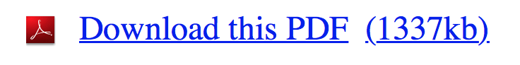

## Coden
###### Frontend development - 2015
#Alle opdrachten

1. [Opdracht 1: Artikel- & Formulierpagina maken in HTML 5](#2)
1. [Opdracht 2: CSS3 Bling Bling & Selectors](#7)
1. [Opdracht 3: Box model, Units & typografie](#10)
1. [Opdracht 4: Media queries & Flexbox](#14)
1. [Opdracht 5: Javascript ClassList Object & de Query Selector](#17)
1. [Opdracht 6: Stappenplan en checklist voor een responsive design](#19)
1. [Opdracht 7: HTML 5 video en Responsive images](#21)

###Eindopdracht beschrijving

Voor Frontend development maken studenten een Reponsive Design in HTML, CSS en Javascript. Voor deze opdracht moet een artikel- en formulierpagina worden uitgewerkt. De artikelpagina heeft een 1. header, 2. main met artikel, 3. footer, 4. sidebar, 5. section met 5 gerelateerde artikelen. De formulierpagina heeft een 1. header, 2. main met formulier, 3. footer, 4. sidebar, 5 section met drie studentenprojecten.

De artikelpagina en formulierpagina moeten responsive zijn. Het web bestaat uit verhoudingen, niet uit absolute waardes. De layout past zich aan aan de scherm-breedte en scherm-hoogte. je moet ontwerp beslissingen maken. Layout is belangrijker dan styling.  Er moet een layout worden  gemaakt voor minimaal 3 breakpoints. De twee pagina's moeten minimaal op je laptop en één touch apparaat worden gepresenteerd.

De eindopdracht wordt, net als deeltoets 1 en 2 in een mondeling getoetst. De docent bevraagt de student en beoordeelt het gemaakte werk op kwaliteit, uitleg en beargumentatie van gekozen (technische) oplossingen en ontwerppatronen.

De website bevat alle onderwerpen zoals die in de lessen zijn behandeld:

Minimaal:

* De website is gemaakt met behulp van HTML5, CSS3 en Javascript
* De pagina's bevatten alle HTML zoals die is aangeleverd. Je mag alleen iets toevoegen of veranderen als de HTML niet toereiken is voor wat je wil vormgeven
* HTML5 moet correct gevalideerd zijn, danwel je moet kunnen uitleggen hoe je een error melding van een validator kan oplossen
* De CSS3 wordt extern ingeladen
* Met behulp van javascript worden dynamisch classes toegevoegd of weggehaald
* Met behulp van media queries is een responsive design gerealiseerd voor minimaal 3 layouts, 2 breakpoints. De pagina’s passen zich aan aan de schermgrootte en de layout verandert voor mobile, tablet en/of desktop formaat
* De layout is in verhoudingen opgemaakt. Er is gebruik gemaakt van procenten en/of Em waardes
* De pagina's bevatten het picture-element om verschillende plaatjes te laden voor verschillende schermen/apparaten. Daarnaast is er een video en/of audio element gebruikt

###Voorbeeld layouts van verschillende schermgroottes voor de artikelpagina.

Maak deze layouts voor de verschillende schermen:

<a href="https://raw.githubusercontent.com/CMDA/FED1/gh-pages/Opdrachten/assets/4.1%20Wireframe%20Intranet%20responsive%20design%201.png">
Deze breakpoints gaan we maken:
</a>

<a href="https://raw.githubusercontent.com/CMDA/FED1/gh-pages/Opdrachten/assets/4.2%20Wireframe%20Intranet%20responsive%20design%202.png">
Zo kunnen de verschillende layouts er uit zien:
</a>

<a href="https://raw.githubusercontent.com/CMDA/FED1/gh-pages/Opdrachten/assets/4.3%20Wireframe%20Intranet%20wireframe.png">
Voorbeeld van 3 wireframe schetsen voor de breakpoints:
</a>

!

## Coden - Opdracht 1.1
###### Frontend development - les 1

### Maak een **Artikelpagina** in HTML 5
Zet het PDF file [artikelpagina.pdf](https://github.com/CMDA/FED1/blob/gh-pages/Maakopdracht/Artikelpagina%20-%20Opleiding%2020140908.pdf) om in een HTML pagina. Gebruik de juiste HTML 5 elementen. Vermijd het gebruik van < div >.

Als de url van een link niet in het PDF file staat, gebruik dan een ancor. 

	<a href="#">tekst</a>

Dit [plaatje](https://github.com/CMDA/FED1/blob/gh-pages/Maakopdracht/plaatjes/beroepen.jpg?raw=true) kun je gebruiken. 

**Resources**

* Resource: [Importance of sections by Heydon Pickering](http://www.smashingmagazine.com/2013/01/18/the-importance-of-sections/)  
* [HTML5 Cheatsheet](http://www.testking.com/techking/infographics/ultimate-html5-cheatsheat/)  
* [HTML5 element flowchart - Section content](http://html5doctor.com/downloads/h5d-sectioning-flowchart.pdf)

!

## Coden - Opdracht 1.2
###### Frontend development - les 1

### Maak een **Formulierpagina** in HTML 5
Zet het PDF file [formulier.pdf](https://github.com/CMDA/FED1/blob/gh-pages/Maakopdracht/Formulierpagina%20-%20Aanmelden%2020140908.pdf) om in een HTML pagina en maak het formulier met valide, toegankelijke HTML. Gebruik labels voor de verschillende elementen. 

**Resources**

* Resource [Dive intro HTML 5 Forms By Mark Pilgrim](http://diveintohtml5.info/forms.html)

!

## Coden - Opdracht 1.3
###### Frontend development - les 1

### Valideer de Artikelpagina en de Formulierpagina 
En verbeter de fouten ...

Zet je code op Github voor de deeltoets. 

**Resources**

* [http://validator.w3.org](http://validator.w3.org)  
* [http://html5.validator.nu/](http://html5.validator.nu/)  
* [Github: Simple collaboration from your desktop](https://desktop.github.com)

!

## Coden - Opdracht 1
###### Frontend development - les 1

###Opmerkingen over HTML5 sematiek

Gebruik de HTML5 tags: Nav, Section, Article, Aside, Footer en bedenk welke content daarin hoort.

Wanneer is een pagina een html pagina? Met: HTML, HEAD, BODY tags/elementen

De doctype-tag staat helemaal bovenaan een HTML document, nog boven de < html > tag. Het zorgt ervoor dat de browser weet welke HTML-variant er wordt gebruikt.
Zo weet een validator op basis van welke regels het document moet worden beoordeeld.
Voeg de doctype toe ...
... en valideer je pagina, kijken wat er gebeurt:

Header in een Section en het gebruik van de H1.
Probeer ook de HTML 5 Outliner

Developers tools voor de browser:

Safari:

Developer
W3C Validator
Firebug lite
Resize me
Firefox:

Webdev extensions
Firebug
Webdeveloper
Chrome:

Web development extensions
Webdeveloper
Firebug Lite

!

## Coden - Opdracht 1
###### Frontend development - les 1

###Opmerkingen over formulieren

Waar zitten de fieldsets? 
Met de fieldset groepeer je content die thematisch bij elkaar hoort.

Een < legend > geeft aan waar het fieldset over gaat. Een titel van de fieldset. Dit element is primair gekoppeld aan de fieldset.

Kloppen de label/input paren?
Een label is gekoppeld aan een input of textarea. Dit is ook belangrijk voor screenreaders. Handig voor gebruik is dat je op een label kan klikken om een element focus te geven.

Met required (bool) geef je aan welke form elementen verplicht zijn (overigens kun je die ook heel makkelijk stylen).

Het attribuut placeholder kun je heel eenvoudig een standaard tekst in een input laten zien. Oude browsers negeren dit.

Bij het number type krijg je in sommige browsers automatisch pijltjes naast het element. Als je geen pijltjes wil, bijvoorbeeld omdat je dit lelijk vindt, zou je een pattern kunnen gebruiken. Dan geef je met een regular-expression aan wat de gebruiker mag invullen... Let op, browsers verwerken dit niet allemaal hetzelfde.

Color type en date geven in sommige browsers een color picker en calender object.

Op mobiele telefoons, verandert het toetsenbord afhankelijk van het type dat je meegeeft. Bijvoorbeeld type="email" geeft een toetsenbord met een @, type="number" geeft een numeriek toetsenbord. Vasilis is helemaal fan van type="date" op iOS. Probeer dit maar eens met de verschillende HTML5 input types .... (OS heeft voor de mac een Iphone emulator die je kan gebruiken met de development kit.)

Bij type="search" laat IOS bijvoorbeeld standaard een x (clear) in het field zien: Handig!

!

## Coden - Opdracht 2.1
###### Frontend development - les 2

###Bling Bling

In deze oefening ga je experimenteren met een aantal CSS3 mogelijkheden. Gebruik de border-radius, box-shadow, text-shadow, transform en transition om je pagina mee te stylen. CSS3 biedt veel mogelijkheden voor CSS styling. Door te experimenteren laten we je kennis maken met hoe CSS werkt en wat je er allemaal mee kunt. Een kleine greep uit wat er zoal mogelijk is. Uiteindelijk moet je voor deeltoets 2 minimaal deze 5 methoden toepassen op de artikel- en formulierpagina. En kunnen uitleggen.

###1. Border-radius
[4 opdrachten](http://vasilis.nl/hva/03/oefeningen.html#slide2) om de CSS border-radius te begrijpen.

**Resources**    

* Resource: [The Humble Border-Radius by Lea Verou](https://www.youtube.com/watch?v=JSaMl2OKjfQ/)
* [Border-radius](https://css-tricks.com/almanac/properties/b/border-radius/)
* [Border-radius specifications](https://developer.mozilla.org/en-US/docs/Web/CSS/border-radius?redirectlocale=en-US&redirectslug=CSS%2Fborder-radius)
* [Border-radius canIuse?](http://caniuse.com/#search=border-radius)

###2. Box-shadow
[4 opdrachten](http://vasilis.nl/hva/03/oefeningen.html#slide7)   om de CSS box-shadow te begrijpen.   

**Resources**    

* [Box-shadow](https://css-tricks.com/almanac/properties/b/box-shadow/)
* [Box-shadow specs](https://developer.mozilla.org/en-US/docs/Web/CSS/box-shadow)
* [Box-shadow canIuse?](http://caniuse.com/#search=box-shadow)

###3. Text-shadow
[4 opdrachten](http://vasilis.nl/hva/03/oefeningen.html#slide12) om CSS text-shadow te begrijpen. 

**Resources**    

* [Text-shadow](https://css-tricks.com/almanac/properties/t/text-shadow/)
* [Text-shadow Specs](https://developer.mozilla.org/en-US/docs/Web/CSS/text-shadow)
* [Text-shadow canIuse?](http://caniuse.com/#search=text-shadow)

###4. Transforms
[1 opdracht](http://vasilis.nl/hva/03/oefeningen.html#slide17) om CSS transform te begrijpen.

**Resources**    

* [Transform](https://css-tricks.com/almanac/properties/t/transform/)
* [Transform Specs](https://developer.mozilla.org/en-US/docs/Web/CSS/transform)
* [Transform canIuse?](http://caniuse.com/#search=transform)

###5. Transitions
[1 opdracht](http://vasilis.nl/hva/03/oefeningen.html#slide19) om CSS transitions te begrijpen.

Spelen met transities:

- Verander de timing delay
- Verander de actergrondkleur
- Verander transparrantie
- Zorg dat alleen de background animeert

**Resources**    

* [Transitions](https://css-tricks.com/almanac/properties/t/transition/)
* [Transitions Specs](https://developer.mozilla.org/en-US/docs/Web/CSS/transform)
* [Transitions canIuse?](http://caniuse.com/#search=transitions)

!

## Coden - Opdracht 2.2
###### Frontend development - les 1

###Selectors
Met selectors, sibling combinators, pseudo classes en attribute selectors kun je elementen in de DOM selecteren en stylen. Hieronder staan een aantal experimenten om met deze selectors te oefenen. Het is de bedoeling dat je deze technieken ook gaat toepassen op de artikel- en formulierpagina en deze laat zien tijdens deeltoets 2.

###1. Child selectors en sibling combinators

Child selectors en sibling combinators [oefening](http://dabblet.com/gist/1864659)

**Resources**    

* [Direct child selector](https://developer.mozilla.org/en-US/docs/Web/CSS/Child_selectors) >
* [Adjacent sibling selector](https://developer.mozilla.org/en-US/docs/Web/CSS/Adjacent_sibling_selectors) +
* De artikelpagina moet er ongeveer [zo](http://dabblet.com/gist/1864548) uitzien

###2. Attribute selectors

Attribute selectors and bling [oefening](http://dabblet.com/gist/1865805)

**Resources**    

* [Attribute selector](https://developer.mozilla.org/en-US/docs/Web/CSS/Attribute_selectors?redirectlocale=en-US&redirectslug=CSS%2FAttribute_selectors) [attr]
* De formulierpagina moet er ongeveer [zo](http://dabblet.com/gist/1865228) uitzien

!

## Coden - Opdracht 2
###### Frontend development - les 1

###Meer resources

* Resource: [How to use pseudo classes by Richard Shepherd](http://www.smashingmagazine.com/2011/03/how-to-use-css3-pseudo-classes/)
* Begin September 2015 heeft Vasilis van Gemert een lezing gegeven op Frontend Conference in Zürich. Het was aan de ene kant een technisch verhaal over responsive web design zonder media queries, maar aan de andere kant ook een visueel en — volgens het publiek — vermakelijk verhaal over dingen maken voor het web. Niet alleen nuttige dingen, maar ook tóffe dingen. Hier staat een link naar de video, de slides en, belangrijker, de bronbestanden zodat je er zelf mee kunt spelen: [https://vasilis.nl/nerd/but-vasilis/](https://vasilis.nl/nerd/but-vasilis/)

!

## Coden - Opdracht 3.1
###### Frontend development - les 3

###Box model

a) In deze oefening ga je de 5 gerelateerde artikelen naast elkaar tonen. Gebruik hiervoor de float, positioning en de inline-block methode. Wat is het verschil? Wat valt je op aan het gebruik van deze methoden?

b) Dit kun je natuurlijk ook toepassen op andere elementen: Toon de gerelateerde artkelen (of projecten) samen met de mededelingen & agenda-items van de aside, in  blokken naast en onder elkaar, afhankelijk van de breedte van het scherm. Dit kan een interessante layout zijn als bv de pagina heel breed is ... 1440 pixels? 1920 pixels?

**Resources**    

* Resource: [CSS Positioning 101 by Noah Stokes](http://alistapart.com/article/css-positioning-101)
* [box-sizing](http://css-tricks.com/box-sizing/) 
* [all about floats](http://css-tricks.com/all-about-floats/)
* [positioning](http://css-tricks.com/almanac/properties/p/position/)
* [display: inline block](https://css-tricks.com/almanac/properties/d/display/)

!

## Coden - Opdracht 3.2
###### Frontend development - les 3

###Typografie: Easy to Read

Zet de tekst van het artikel op een goed leesbare grootte en bepaal de verhoudingen van de verschillende H elementen. 
Bepaal de lengte van de zinnen. 
Gebruik de EM waarde. 
Staat de regelafstand goed? 

Je weet niet hoe groot je gebruiker de tekst wil lezen. 
Wel wil je de verhoudingen bepalen. 
Kan het ietsje minder? Window Licking?

**Resources**

* [Viewport sized Typography](http://css-tricks.com/viewport-sized-typography/)
* [Em or REM](http://nerd.vasilis.nl/use-em-rem-right-use-cases/)
* [Theres more to the css REM unit than font sizing](http://css-tricks.com/theres-more-to-the-css-rem-unit-than-font-sizing/)

!

## Coden - Opdracht 3.3
###### Frontend development - les 3

### Units voor layout

Experimenteer met de tekst van het artikel door het in meerdere kolommen te zetten. 
Bepaal de verhoudingen in em of rem. 
Hoe breed moeten de kolommen zijn voor een goede regellengte?
Hoeveel ruimte moet er tussen de kolommen?

**Resources**
[CSS Columns](http://css-tricks.com/guide-responsive-friendly-css-columns/)

!

## Coden - Opdracht 3
###### Frontend development - les 3

###Meer resources

* Resource: [Learn CSS layout](http://learnlayout.com/toc.html)

**Reminder**

- Units for Fonts
    - px, EM, %, pt, Keyword
- Units for Layout
    - EM voor max/min breedtes
        - Anything from 45 to 75 characters is widely regarded as a satisfactory length of line
        - a column is easy to read if it's wide enough to accommodate an average of 10 words per line
    - REM voor margins & paddings
        - Altijd gerelateerd aan de grootte van de font-size van het html-element
        - Perfect voor margins en paddings, die gelijk kunnen blijven, ongeacht de font-grootte 
    - Viewport relative units
        - VW - viewport width
        - VH - viewport height
        - VMAX - de grootste van de width of de height
        - VMIN - de kleinste van de width of de height

!

## Coden - Opdracht 4.1
###### Frontend development - les 4

###Flexbox

Vorige week heb je geëxperimenteerd met positioning, float en display inline block om de layout aan te passen. Vandaag krijg je nog een methode: de Flexbox.

a) Experimenteer met de Flexbox op de header: Zet alle items in de Header op een rij. Draai daarna de volgorde om, het laatste items vooraan (links) en de eerste achteraan (rechts). Kun je de 6 elementen ook zo naast elkaar plaatsen dat ze netjes horizontaal worden uitgelijnd? Ook als je het browser venster kleiner of groter maakt?

b) In de articles van de artikel-pagina staat een footer met de auteur-informatie. Kun je deze ook onder aan het artikel zetten met behulp van de Flexbox? 

(Use case: op een groot scherm kun je bovenaan het artikel de auteursinformatie tonen, met een fotootje van de schrijver, maar op een mobiel wil je de beperkte schermgrootte gebruiken voor het artikel zelf, daar waar de gebruiker voor komt, en dan kun je de auteursinformatie onderaan presenteren)

* Resource: [A complete guide to Flexbox](https://css-tricks.com/snippets/css/a-guide-to-flexbox/)
* Resource: [Flexbox insights](http://buildawesomewebsites.com/blog/46104/flexbox-insights)
* [Flexbox - Can I Use?](http://caniuse.com/#feat=flexbox) 

!

## Coden - Opdracht 4.2
###### Frontend development - les 4

###Media queries
De artikel- en formulierpagina heb je in les 2 en 3 gestyled naar goed leesbare content, met goede font-groottes, regel-lengte en line-height. Misschien wat schaduw en een blinky border-radius?

Met behulp van Media querie kun je verschillende breakpoints maken. Werk nu vanaf mobiel naar bredere schermen. Bepaal de verschillende Media queries. Vanaf welke breedte ga je over naar een andere layout? Dat kan bijvoorbeeld als de regels te lang worden en er genoeg (wit)ruimte is om een kolom naast het artikel te plaatsen. Maak minimaal 3 breakpoints met behulp van Media queries, en maak voor elke een geschikte layout.

Op de volgende pagina staat een [wireframe voorbeeld](#4) van hoe de pagina's eruit kunnen komen te zien.

**Resources**    

* Resource: [How To Use CSS3 Media Queries To Create a Mobile Version of Your Website by Rachel Andrew ](http://www.smashingmagazine.com/2010/07/how-to-use-css3-media-queries-to-create-a-mobile-version-of-your-website/)
* [Media queries](https://css-tricks.com/css-media-queries/)
* [W3C Media Queries Specs](http://www.w3.org/TR/css3-mediaqueries/)

!

## Coden - Opdracht 4
###### Frontend development - les 4

###Meer resources

* Resource: [Learn CSS layout](http://learnlayout.com/toc.html)
* Resource: [What the Flexbox?! by Wes Bos](http://flexbox.io/)
* Resource: [Solved by Flexbox by Philip Walton](https://philipwalton.github.io/solved-by-flexbox/)
* Resource: [Web layout with Flexbox](http://www.webdesignerdepot.com/2015/09/modern-web-layout-with-flexbox/)
* Resource: [The EMs have it: Proportional Media Queries by Lyza Gardner](http://blog.cloudfour.com/the-ems-have-it-proportional-media-queries-ftw/)

###Inspiratie

* Flexbox voorbeeld ronw/column/order responsive [Michele's experiment](http://www.michele.nl/flexbox)
* Layout en design voorbeelden [Mediagueri.es](http://www.mediaqueri.es)

!

## Coden - Opdracht 5.1
###### Frontend development - les 5

###Attributes selector toepassen

#### Download een pdf file - plaatje dynamisch tonen

In opdrachten van les 2 heb je geleerd hoe je in CSS met de Attribute selector en before/after content 'in je HTML schrijven'.

In deze oefening gaan we dat nogmaals gebruiken. Met het pseudo element Content kun je dynamisch HTML stylen. Als bv een download link eindigt op .pdf dan kun je met CSS een icoontje plaatsen.

Je hebt deze HTML bij de '3 related projects' in de formulier-pagina:

	<h4>Downloads</h4>
      <ul>
		<li><a href="bron.pdf" data-kb="1267">project_CMDA_Moet_ik_rennen.pdf</a> (1.3MB)</li>
		<li><a href="bron.vcf">Contactgegevens_CMDA_Moet_ik_rennen.vcf</a></li>
		<li><a href="bron.jpg" data-kb="569">Poster_CMDA_Moet_ik_rennen.jpg</a> (569KB)</li>
	  </ul>

Zorg er voor dat je bij de pdf en/of vcf en/of jpg link een bijhorend plaatje toont. Dat ziet er zo uit:

**Resource**

* [Attribute selectors](https://developer.mozilla.org/en-US/docs/Web/CSS/Attribute_selectors?redirectlocale=en-US&redirectslug=CSS%2FAttribute_selectors)
* [Pseudo Element: Content](http://css-tricks.com/css-content/)
* [plaatje pdf download](http://www.adobe.com/images/shared/product_mnemonics/50x50/acrobat_reader_50x50.gif)
* [plaatje vcf download](http://www.sentinel-it.nl/Images/vcard-icon.png)
* [plaatje jpg download](http://www.yudanaka-shibuonsen.com/userfiles/image/jpg.png)

<!-- * [spoiler] Dat ziet er ongeveer [zo](http://dabblet.com/gist/77c4ad3f79e24b0dce8b) uit -->

!

## Coden - Opdracht 5.2
###### Frontend development - les 5

###Javascript ClassList Object aanspreken met de Query selector functie

#### Fieldset toggelen

a) In deze oefening gaan we met de Javascript Classlist object en de query selector een Fieldset in je formulier toggelen. (aan/uit zetten)
Afhankelijk van de keuze van een gebruiker kun je dan een ander deel van het formulier tonen.

1. Maak een Css class aan die een fieldset laat zien en/of verbergt
2. Voeg een Javascript file aan je Formulier pagina toe
3. Schrijf een functie die een classlist toevoegt aan de fieldset
    Tips:
    * Gebruik de querySelector om de juiste Fieldset te selecteren 
    * Gebruik de querySelector om de button of radio-button te selecteren
    * Koppel de functie die de toggle uitvoert

b) Kun jij de toggle ook met een animatie maken?

**Resources** 

* Resource: [Manipulating classes using the class list API by Matt West](http://blog.teamtreehouse.com/manipulating-classes-using-classlist-api)
* Resource: [We Don’t Need Classes by Heydon Pickering](http://www.smashingmagazine.com/2012/06/classes-where-were-going-we-dont-need-classes/)
* [Pseudo class selectors](http://css-tricks.com/pseudo-class-selectors/)
* [Document.QuerySelectors](https://developer.mozilla.org/en-US/docs/Web/API/document.querySelector)
* [Element.QuerySelectors](https://developer.mozilla.org/en-US/docs/Web/API/element.querySelector)

<!-- [spoiler] Antwoord in [Dablet](http://dabblet.com/gist/e1f0e90f3020aef83c9b) -->

!

## Coden - Opdracht 6
###### Frontend development - les 6

###Probeer deze deze vragen te beantwoorden voor je eigen design. En maak het !

###Stappenplan en checklist

1. Wat doe je met de Header in een smal scherm?
2. Waar gaat de Sidebar heen als het scherm breed is?
3. Hoe staan de sections met Projecten of related content?
4. Wat gebeurt er als de gebruiker de pagina gaat zoomen?

1. Zorg ervoor dat de Meta Viewport goed staat, waar is die ook alweer voor?

1. Pas de marges en/of padding van de pagina aan in de mobile view (deze mogen dichter op de rand van je telefoon - probeer maar eens)
2. Heb je goede leesbare teksten voor mobiel (font-size, line-height, regel-lengte)
3. Hoeveel ruimte heeft de header nodig op mobiel?
4. Misschien wil je van de project-artikelen en related-artikelen op mobiel wel alleen de titel laten zien? Met een toggle inklappen/uitklappen ?

1. Zijn de regels van het < main > artikel niet te lang?
2. Kunnen de project-artikelen en related-artikelen in meedere kolommen naast elkaar?

* Hoe groot mogen die input-velden? En op mobiel met dikke vingers?
* Animatie op tab, als het input-veld een focus krijgt?
* De input-velden de hele breedte laten gebruiken op mobiel werkt vaak goed

1. Hoe ziet het formulier er uit op een breder scherm?

!

## Coden - Opdracht 6
###### Frontend development - les 6

###Meer resources

####Layout

* Resource: [Learn CSS layout](http://learnlayout.com/toc.html)

####Flexbox

* Resource: [A complete guide to Flexbox](https://css-tricks.com/snippets/css/a-guide-to-flexbox/)
* [What the Flexbox?! by Wes Bos](http://flexbox.io/)
* [Flexbox playground and code generator by Pete Boere](http://the-echoplex.net/flexyboxes/)
* [Solved by Flexbox by Philip Walton](https://philipwalton.github.io/solved-by-flexbox/)
* [Web layout with Flexbox](http://www.webdesignerdepot.com/2015/09/modern-web-layout-with-flexbox/)
* Flexbox voorbeeld row/column/order responsive [Michele's experiment](http://www.michele.nl/flexbox)

####Units, EM, REM

* [Em or REM by Vasilis van Gemert](http://nerd.vasilis.nl/use-em-rem-right-use-cases/)
* [The EMs have it: Proportional Media Queries by Lyza Gardner](http://blog.cloudfour.com/the-ems-have-it-proportional-media-queries-ftw/)

###Inspiratie

* Layout en design voorbeelden [Mediagueri.es](http://www.mediaqueri.es)

!

## Coden - Opdracht 7.1
###### Frontend development - les 7

###Responsive images

Gebruik srcset om verschillende .jpg files te tonen op verschillende schermgroottes

Gebruik voor deze oefening de plaatjes die in het [lesprogramma op Github](https://github.com/CMDA/FED1/tree/gh-pages/Opdrachten/html/img/responsive_images) staan.

**Resources**

* Resource: [Native responsive Images by Yoav Weiss](https://dev.opera.com/articles/native-responsive-images/)
* [Built-in Browser Support for Responsive Images](hhttp://www.html5rocks.com/en/tutorials/responsive/picture-element/)
* [Caniuse Picture-element?](http://caniuse.com/#search=picture) 

<!--Antwoord in [Dablet](http://dabblet.com/gist/e173b03e74e908cf3c29)-->

!

## Coden - Opdracht 7.2
###### Frontend development - les 7

###HTML5 Video 

Plaats onderstaande bronbestanden in een < video > element in een pagina.
De video moet voor iedereen met een hedendaagse browser werken.
Zorg voor een fallback voor oude browsers. 

Video bronbestanden staan op [Github](https://github.com/CMDA/FED1/tree/gh-pages/Opdrachten/html/videos)

**Resources**

* [The Video Element](https://developer.mozilla.org/en-US/docs/Web/HTML/Element/video)
* [Html5 supported media formats](https://developer.mozilla.org/en-US/docs/Web/HTML/Supported_media_formats)
* [What formats do I need for HTML5 video](http://blog.zencoder.com/2013/09/13/what-formats-do-i-need-for-html5-video/)

!

that's all.

< /section >

