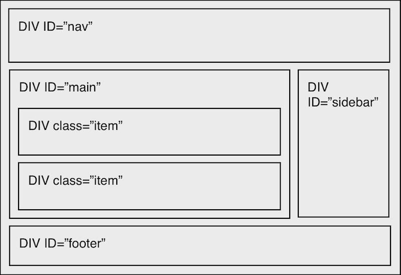

< section >
# Give me a fucking &lt;br /&gt;
###### Frontend development - les 1

!

# Give me a fucking &lt;br /&gt;
###### Frontend development - les 1

Deze les gaat over: WTF is HTML5? (ook alweer?). 
Hoe wordt deze  webtechnologie ondersteund? 
We gaan aan de slag met HTML semantiek en de belangrijkste structuur elementen komen aan bod, Doctype, Meta, Script, Section, Header, Footer, Nav, Article, Main. 
Én we gaan formulieren maken.

!

# Give me a fucking &lt;br /&gt;
###### Frontend development - les 1

## Programma (200 minuten)
1. Introductie (20)
2. College (30)
3. Weekly Nerd (30)
4. Klussen (100)
5. Terugkijken (20)

!

# Give me a fucking &lt;br /&gt;
###### Frontend development - les 1
## Lesdoelen

* **Werkwijze en planning** van het vak doornemen
* **Introductie HTML5**. Recap van vorg jaar.
* Belangrijkste **HTML5 structuur elementen** begrijpen en toepassen:
    * Doctype, Meta, Script, 
    * Header, Main, Footer, Nav, Aside, 
    * Section, Article, 
    * Formulieren, input types
* **Formulieren** maken

!

# 1. Introductie (20 minuten)
###### Frontend development - les 1

Wat gaan we doen de komende 8 weken?

!

##### 1. Introduktie (20/200 minuten)
# Huishoudelijke mededelingen

* **Op tijd komen**, anders buiten wachten tot we klaar zijn en naar het volgende onderdeel gaan (deur dicht == wachten)
* Mededelingen komen op **[Intranet](https://cmd.dmci.hva.nl/NL/Paginas/default.aspx)**, 
het lesprogramma staat op **[Moodle](https://moodle.dmci.hva.nl/moodle21/course/view.php?id=131)**, alle sources op **[Github](https://github.com/CMDA/FED1)**
* Stel je vragen het aan je mede-studenten of wacht tot volgende week (of loop even een andere FeD les in). **Niet mailen.**
* **Laptop** nodig voor de werkopdrachten  
* **Papier en pen** voor discussies en college

!

##### 1. Introduktie (20/200 minuten)
# Docenten

Wie is wie?   

Wie doet wat?

!

##### 1. Introduktie (20/200 minuten)
# Wat gaan we maken?
In het vak Frontend development leer je een responsive website maken. Dat is een website die zich automatisch aanpast aan de context, het apparaat, de omgeving en de interactiemogelijkheden.

**Eindopdracht is een responsive website van ons intranet: een artikelpagina en een formulierpagina**

* Wat kun je over 8 weken?
	* [www.tropenmuseum.nl](http://www.tropenmuseum.nl) Voorbeeld Responsive 2011 
	* [www.rijksmuseum.nl](http://www.rijksmuseum.nl) Total web experience ? 2013
    * [decorrespondent.nl](https://decorrespondent.nl/home#) 100% Leesbaar multi device
	* [Komkommersalade](http://vasilis.nl/presentaties/eretail/site/shop.php) Voorbeeld Responsive webshop (P4)
* Inspiratie
    * [Mediaqueri.es](http://www.mediaqueri.es)

!

##### 1. Introduktie (20/200 minuten)
# Werkwijze
Hoe zien de lessen van 4 uur eruit?

1. Iedere les krijg je een **college** van een half uur.
2. Daarna gaan we artikelen bespreken in de **Weekly Nerd**. 
De artikelen moet je als huiswerk lezen.
3. Dan is het **klussen, coden, nerden**. Ongeveer 2 uur per les gaan we werken aan oefenopdrachten en de eindopdracht. De studentassistenten en docenten lopen rond om te helpen. Je werk in duo's aan je eigen opdracht. 

Zie [Moodle](https://moodle.dmci.hva.nl/moodle21/course/view.php?id=131) voor het lesprogramma. 
De colleges en lesplannen staan ook [online](http://cmda.github.io/FED1/).
Zie [Github](https://github.com/CMDA/FED1) voor de source files.

!

##### 1. Introduktie (20/200 minuten)
# Planning & toetsplan

Het vak bestaat uit 2 deeltoetsen, de eindopdracht en de Weekly Nerd.

1. **Deeltoets 1** (AVV) - les 2 (volgende week). 
Over HTML5 & formulieren
2. **Deeltoets 2** (AVV) - les 5. 
Over CSS3 effecten, selectors, flexbox & boxmodel
3. **Eindopdracht** (Cijfer) - Les 8.
Een Responsive webdesign
4. **Weekly Nerd** (AVV) - iedere week.
Artikelen lezen en bespreken.

Als je niet voldoet aan de gestelde criteria voor de Weekly Nerd dan kun je dat onderdeel herkansen door een tentamen te maken.

De deeltoetsen en eindopdracht worden getoetst met een mondeling. De herkansing van de deeltoetsen is ongeveer 48 uur later. Als je een deeltoets niet haalt kun je het vak niet meer halen.

!

# 2. College - 30 minuten
###### Frontend development - les 1

College [Give me a Fucking < br / >](../Colleges/les1-gimme-a-fucking-br/index.html)
Over waarom dit vak? Over vroeger. Over HTML5 elementen, formulieren, browsers en devices.

!

# 3. Weekly Nerd - 30 minuten
###### Frontend development - les 1
Iedere les gaan we artikelen bespreken in kleine groepen. 

Je wordt beoordeeld op je kennis niveau en inbreng tijdens de sessie. Van de 7 sessies mag je er *niet* meer dan 1 missen of onvoldoende halen. Als je niet voldoen aan de gestelde criteria voor de Weekly Nerd dan moet dit onderdeel herkanst worden met een tentamen.

!

##### 3. Weekly Nerd (30 - 80/200 minuten)
# Artikelen voor vandaag

* [Concept to Code: Code literacy in UX by by Ryan Betts](http://uxmag.com/articles/concept-to-code)
* [Semantics in HTML 5 by John Allsopp](http://alistapart.com/article/semanticsinhtml5)
* [Importance of sections by Haydon Pickering](http://www.smashingmagazine.com/2013/01/18/the-importance-of-sections/)

!

##### 3. Weekly Nerd (30 - 80/200 minuten)
# Wie zit waar?

lijst op beamer tonen met wie waar zit ...

!

# 4 Klussen - 100 minuten
###### Frontend development - les 1
Laptop en internet  
Opstelling werkeilanden van 6 personen - duo's zitten naast elkaar

!

##### 4. Klussen (100 - 180/200 minuten)
##Werken in duo's aan je eigen website
Introductie duo’s maken en aan de tafels naast elkaar gaan zitten

!

##### 4. Klussen (100 - 180/200 minuten)
### Opdracht 1.1 - 15 minuten
## Semantic Markup 

Maak deze ‘traditionele’ pagina-indeling in HTML5.  
Gebruik hiervoor de HTML5 tags: Nav, Section, Article, Aside, Footer

 
**Resources**

* [HTML5 Periodic Table of Elements](http://joshduck.com/periodic-table.html)  
* [HTML5 Cheatsheet](http://www.testking.com/techking/infographics/ultimate-html5-cheatsheat/)  
* [HTML5Doctor section flowchart](http://html5doctor.com/downloads/h5d-sectioning-flowchart.pdf)

!

### Bespreken Opdracht 1.1
## Semantic Markup 

Voorbeeld van studenten in Dabblet tonen.

Ga naar [www.dabblet.com](http://www.dabblet.com)

'new Dabblet ' Maak een nieuwe Dabblet aan (of koppel deze aan je Github)

'Save anonymously' Bewaar de Dabblet 

'Throw url' Gooi de url op het bord

[http://dabblet.com/gist/1717587](http://dabblet.com/gist/1717587)

!

##### 4. Klussen (100 - 180/200 minuten)
### Opdracht 1.2 - 15 minuten
## HTML pagina?

De gemaakte pagina in opdracht 1 is nog GEEN html pagina  

Wanneer is een pagina een html pagina?  
 
Met: HTML, HEAD, BODY tags/elementen  

Voeg deze toe...

!

### Bespreken Opdracht 1.2 
## HTML pagina?

Laten zien 

[http://dabblet.com/gist/1717587](http://dabblet.com/gist/1722640)

!

##### 4. Klussen (100 - 180/200 minuten)
### Opdracht 1.3 - 10 minuten
## Doctype en Validatie
De doctype-tag staat helemaal bovenaan een HTML document, nog boven de < html > tag. 
Het zorgt ervoor dat de browser weet welke HTML-variant er wordt gebruikt.

Zo weet een validator op basis van welke regels het document moet worden beoordeeld.

Voeg de doctype toe ...

... en valideer je pagina, kijken wat er gebeurt:

[http://validator.w3.org](http://validator.w3.org)  

[http://html5.validator.nu/](http://html5.validator.nu/)  

!

### Bespreken Opdracht 1.3
## Doctype en Validatie

Pagina valideren, kan hier:

[http://validator.w3.org](http://validator.w3.org)  

[http://html5.validator.nu/](http://html5.validator.nu/)  

Developers tools voor de browser:  

Safari:  
- [Developer](https://developer.apple.com/technologies/safari/developer-tools.html)  
- [W3C Validator](https://extensions.apple.com/)  
- [Firebug lite](https://extensions.apple.com/)  
- [Resize me](https://extensions.apple.com/)

Firefox:  
- [Webdev extensions](https://addons.mozilla.org/en-US/firefox/extensions/web-development/)  
- [Firebug](https://addons.mozilla.org/en-US/firefox/addon/firebug)  
- [Webdeveloper](https://addons.mozilla.org/z//en-US/firefox/addon/web-developer/  )

Chrome:  
- [Web development extensions](https://chrome.google.com/webstore/category/ext/11-web-development)  
- Webdeveloper    
- Firebug Lite  

!

##### 4. Klussen (100 - 180/200 minuten)
### Opdracht 1.4 - 10 minuten
## Hiërarchie van elementen 

Extreme programming: Meekijken met docent:    

Header in een Section en het gebruik van de H1.  

[HTML 5 Outliner](http://gsnedders.html5.org/outliner/)

!

##### 4. Klussen (100 - 180/200 minuten)
### Opdracht 1.5 - 50 minuten
## HTML5 Webforms 2.0

In HTML5 zijn hele veel meer (functionele) mogelijkheden bedacht voor formulieren

placeholder > text voor leeg form field

    <input type="text" id="hobbies" placeholder=”gimme some”>

!

autofocus

    <input type="text" id="status" autofocus>

!

required

    <input type="password" id="pw" required> 

!

autocomplete > disable auto-complete, bv veiligheid

    <form autocomplete="off">

of

    <input type="text" autocomplete="off">

!

datalist

    <input type="text" id="all_your_coders_r_belong_to_us" list="code_archetypes">
        <datalist id="code_archetypes">
            <option value="enthusiast">
            <option value="mash-up-artist">
            <option value="inventor">
            <option value="wizard">
        </datalist

!

Input types 

    <input type=””>

searching

contact types: email, website, phone

range (slider)

number

dates and times

color pickers

pattern 

!

##### 4. Klussen (100 - 180/200 minuten)
### Opdracht 1.5 - 50 minuten
## HTML5 Webforms 2.0

Maak het volgende formulier met valide, toegankelijke HTML. 
Gebruik labels voor de verschillende elementen, vb:

    <label for=”naam”>naam</label>
	<input id=”naam”>

Formulier:
opdracht staat ook hier [http://dabblet.com/gist/19109aa625ef7e222432](http://dabblet.com/gist/19109aa625ef7e222432)

    1. Contactgegevens
    1a. Naam
    1b. E-mail
    1c. Straatnaam
    1d. Nummer
    1e. Postcode
    1f. Land
    1g. Telefoonnummer

    2. Voorkeuren
    2a. Lievelingskleur
    2b. Leukste maand
    2c. Hoe goed is dit ongeveer? (1 tm 10)

!

### Bespreken Opdracht 1.5
## HTML5 Webforms 2.0
Heeft een student een mooie oplossing?

Gooi in [Dabblet](http://www.dabblet.com)!

Het resultaat moet er ongeveer zo uitzien:
[Uitgewerkt formulier](http://dabblet.com/gist/2339841)

Klassiek formulier zou er zo uit zien: 
[Uitgewerkt formulier](http://dabblet.com/gist/2339794)

!

### Opmerkingen over formulieren

Waar zitten de fieldsets? Met de fieldset groepeer je content die thematisch bij elkaar hoort.

Een < legend > geeft aan waar het fieldset over gaat. Een titel van de fieldset. Dit element is primair gekoppeld aan de fieldset.

Kloppen de label/input paren?

Een label is gekoppeld aan een input of textarea. Dit is ook belangrijk voor screenreaders. Handig voor gebruik is dat je op een label kan klikken om een element focus te geven.

Met required (bool) geef je aan welke form elementen verplicht zijn (overigens kun je die ook heel makkelijk stylen).

Het attribuut placeholder kun je heel eenvoudig een standaard tekst in een input laten zien. Oude browsers negeren dit.

Bij het number type krijg je in sommige browsers automatisch pijltjes naast het element. Als je geen pijltjes wil, bijvoorbeeld omdat je dit lelijk vindt, zou je een pattern kunnen gebruiken. Dan geef je met een regular-expression aan wat de gebruiker mag invullen... Let op, browsers verwerken dit niet allemaal hetzelfde.

Color type en date geven in sommige browsers een color picker en calender object.

Op iOS, mobile OS van Apple, verandert het toetsenbord afhankelijk van het type dat je meegeeft. Bijvoorbeeld type="email" geeft een toetsenbord met een @, type="number" geeft een numeriek toetsenbord. Vasilis is helemaal fan van type="date" op iOS. Probeer dit maar eens met de verschillende HTML5 input types .... (OS heeft voor de mac een Iphone emulator die je kan gebruiken met de development kit.)

Bij type="search" laat IOS bijvoorbeeld standaard een x (clear) in het field zien: Handig!

!

# 5. Terugkijken 20 minuten
###### Frontend development - les 1

Wat hebben we behandeld?

* **Werkwijze en planning** van het vak doornemen
* **Introductie HTML5.** Recap van vorg jaar.
* Belangrijkste **HTML5 structuur elementen** begrijpen en toepassen:
    Doctype, Meta, Script, 
    Header, Main, Footer, Nav, Aside, 
    Section, Article, 
    Formulieren, input types
* **Formulieren** maken

*Namen doorgeven van duo’s, als je dit nog niet hebt gedaan bij de studentassistent*

!

##### 5. Terugkijken (20 - 200/200 minuten)
# Huiswerk aankondigen

* **Weekly Nerd** voorbereiden:  
  Lezen wat op Moodle staat bij les 2.
  
* **Deeltoets 1** voorbereiden: 2 pagina's maken:
    1. Artikel pagina
    2. Formulier pagina

!

##### 5. Terugkijken (20 - 200/200 minuten)
# Deeltoets 1 Opdracht

###Wat moet je af hebben voor de deeltoets volgende week?

1. Een **artikelpagina**: Een semantisch correcte pagina met teksten die op [Moodle](https://moodle.dmci.hva.nl/moodle21/course/view.php?id=131) staan bij les 2.  
2. Een **formulierpagina**: Maak van je formulier pagina het formulier dat op [Moodle](https://moodle.dmci.hva.nl/moodle21/course/view.php?id=131) staat.

Artikelpagina: Semantisch correcte pagina met de elementen zoals we die hebben behandeld in les 1: Nav, Section, Article, Aside, Footer, Doctype, Html, Header, Body, Charset, Meta

Formulierpagina met veschillende input types, labels, fieldsets, required

En je moet natuurlijk van alles kunnen uitleggen wat het betekent en hoe het werkt !

!

##### 5. Terugkijken (20 - 200/200 minuten)
# Deeltoets 1 Mondeling

### Hoe werkt dat zo'n mondeling?

De deeltoets wordt tijdens de les afgenomen. 

Het schema komt op bord.

15 minuten per quatro (dubbele duo's). 
Dat is dus hard werken !

Toetsen terwijl de rest van de klas doorwerkt aan de lesopdrachten.

Herkansen ? 48 uur later ...

!

## op.

 
 

[Tussenstand AVV's en Weekly Nerd](https://docs.google.com/spreadsheets/d/1Uo9a3xRDhs6M3dWl0AgJ05UZNJDh6REjCwpxT3aZs2w/pubhtml) klik klik klik

< / section >
