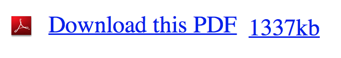
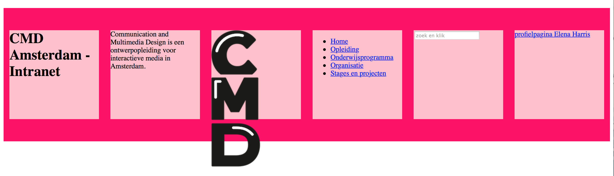
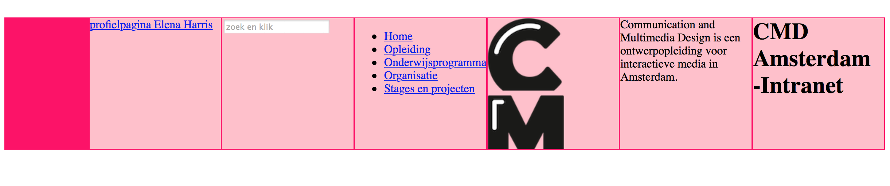
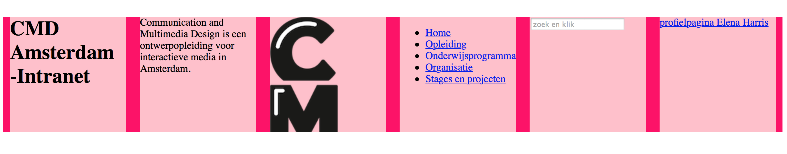
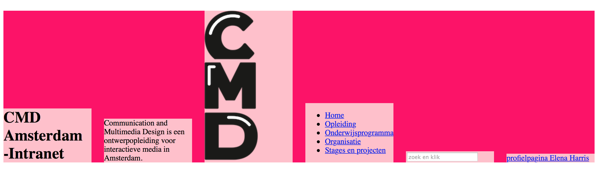
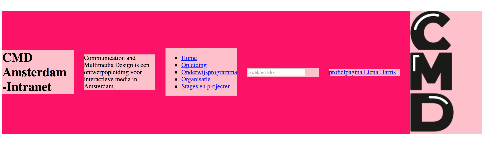

< section >
# I’ve got < em >
###### Frontend development - les 3

!

# I’ve got < em >
###### Frontend development - les 3
Deze les gaat over het Javascript ClassList Object, 
waarmee je dom elementen kunt selecteren en classes kan toewijzen. 
We gaan aan de slag met de Flexbox en units for typografie, zoals pixels, ems en procenten. 

!

# I’ve got < em >
###### Frontend development - les 3

## Programma (200 minuten)
1. Introduktie (5)
2. College (30)
3. Weekly Nerd (30)
4. Klussen (120)
5. Terugkijken (10)

!

# 1. Introduktie - 5 minuten
###### Frontend development - les 3

## Lesdoelen

- Leren hoe het Javascript ClassList Object en de Query selector te gebruiken om dynamisch classes toe te voegen
- Spelen met de Flexbox en grids
- Leren over units, pixels, em's, procenten

!

# 2. College - 30 minuten
###### Frontend development - les 3

College [I've Got Em](http://cmda.github.io/FED1/Colleges/les3-i-ve-got-em/index.html)
Over Javascript ClassList Object aanspreken met query selector functie, de Flexbox, Grids en Units

!

# 3. Weekly Nerd - 30 minuten
###### Frontend development - les 3
Iedere les bespreken we artikelen in kleine groepen. 

Je wordt beoordeeld op je kennis niveau en inbreng tijdens de sessie. 
Van de 7 sessies mag je er *niet* meer dan 1 missen of onvoldoende halen. 
Als je niet voldoen aan de gestelde criteria voor de Weekly Nerd 
dan moet dit onderdeel herkanst worden met een tentamen.

!

##### 3. Weekly Nerd (30 - 65/200 minuten)
# Artikelen voor vandaag

* [Using pixels is not very polite by Vasilis van Gemert](http://nerd.vasilis.nl/using-pixels-polite/)
* [Classes? Where We’re Going, We Don’t Need Classes! by Haydon Pickering](http://www.smashingmagazine.com/2012/06/19/classes-where-were-going-we-dont-need-classes/)
* [Manipulating Classes Using The classList API by Matt West](http://blog.teamtreehouse.com/manipulating-classes-using-classlist-api)

!

##### 3. Weekly Nerd (30 - 65/200 minuten)
# Wie zit waar?

lijst op beamer tonen met wie waar zit ...

!

# 4 Klussen - 120 minuten
###### Frontend development - les 3
Laptop en internet  
Opstelling werkeilanden van 6 personen - duo's zitten naast elkaar

1. Javascript & Attribute selectors (70 minuten)
    * Attribute selectors: Required sterretje
    * Attribute selectors: Download PDF file
    * Javascript ClassList Object aanspreken met query selector functie
2. Flexbox (50 minuten)

!

##### 4. Klussen (deel 1: 70 - 135/200 minuten)
### Opdracht 2.7.3 - 10 minuten
## Attribute selectors: Required sterretje

Hoe ging dit ook alweer?

**Toon met CSS dynamisch iets op het scherm**

Voeg dit toe aan je formulier pagina:
Zorg ervoor dat er een rood sterretje komt te staan bij de required input velden. 
Gebruik hiervoor de attribute selector.

	<label for="naam">Naam</label>
	<input type="text" id="naam" required>

    <label for="email">Email</label>
	<input type="email" id="email" required>

!

### Bespreken Opdracht 2.7.3
## Required sterretje

<!--dablet uitleg-->
Dat ziet er [zo](http://dabblet.com/gist/dc930a11e879bf6d2ef9) uit.

    /* 
    Dit blok zorgt er voor dat er een rood sterretje komt te 
    staan voor/achter de elementen die hieraan voldoen:
    Een element met het attribuut for="naam"
    Een element met het attribuut for="email"
    */
    
    [for="naam"]:before,
    [for="email"]:after {
	   content: " *";
	   color: red;
	   font-size: 2em;
    }
    
**Resources** 
[Pseudo Element: Before & After](http://css-tricks.com/almanac/selectors/a/after-and-before/)
[Attribute Selector](http://css-tricks.com/attribute-selectors/)
[Pseudo Class Selector: Required](http://css-tricks.com/almanac/selectors/r/required/)

!

##### 4. Klussen (deel 1: 70 - 135/200 minuten)
### Opdracht 3.1 - 20 minuten
## Attribute selectors: Download PDF file

In opdracht 2.7 van vorige les zat de opdracht met het *.
In CSS kun je met de Attribute selector en before/after content 'in je HTML schrijven'.

In deze oefening gaan we dat nogmaals gebruiken. Met het pseudo element Content kun je dynamisch je HTML stylen. Als bv een download link eindigt op .pdf dan kun je met CSS een icoontje plaatsen en het aantal kb's.

Je hebt deze HTML

    <a href=“http://example.com/file.pdf” data-kb=“1337”>A white paper</a>

Zorg er voor dat dit er zo uit komt te zien 

!

### Bespreken Opdracht 3.1
## Download een pdf file

Antwoord in [Dablet](http://dabblet.com/gist/77c4ad3f79e24b0dce8b).

Laat zien hoe content werkt: zowel met “content tussen quotes”, 
als met de url() en de attr() functies en combinaties daarvan.

**Resources**
[Pseudo Element: Content](http://css-tricks.com/css-content/)

!

##### 4. Klussen (deel 1: 70 - 135/200 minuten)
### Opdracht 3.2 - 40 minuten
## Javascript ClassList Object aanspreken met query selector functie

### Fieldset toggelen

In opdracht 2.7 en 3.1 heb je geleerd hoe je met CSS met de Attribute selector en before/after content 'in je HTML schrijven'.

In deze oefening gaan we met de Javascript Classlist object en de query selector een Fieldset in je formulier toggelen. (aan/uit zetten)
Afhankelijk van de keuze van een gebruiker kun je dan een ander deel van het formulier tonen.

1. Maak een class aan die een fieldset displayed en/of 'uit' zet
2. Voeg een Javascript file aan je Formulier pagina toe
3. Schrijf een functie die een classlist toevoegt aan de fieldset
    Tips:
    * Gebruik de querySelector om de juiste Fieldset te selecteren 
    * Gebruik de querySelector om de button of radio-button te selecteren
    * Hang een functie aan de die de toggle uitvoert

!

### Bespreken Opdracht 3.2
## Fieldset toggelen

Antwoord in [Dablet](http://dabblet.com/gist/e1f0e90f3020aef83c9b).

Kun jij de toggle ook met een animatie maken ? 

**Resources** 
[Pseudo class selectors](http://css-tricks.com/pseudo-class-selectors/)
[The Classlist Object](http://blog.teamtreehouse.com/manipulating-classes-using-classlist-api)
[Document.QuerySelectors](https://developer.mozilla.org/en-US/docs/Web/API/document.querySelector)
[Element.QuerySelectors](https://developer.mozilla.org/en-US/docs/Web/API/element.querySelector)

!

##### 4. Klussen (deel 2: 50 - 185/200 minuten)
### Opdracht 3.3 - 50 minuten
## Flexbox

In deze opdracht gaan we experimenteren met Flexbox. 

Voeg eerst deze HTML toe aan je artikel-pagina, Stop dit in je header:
1. Nav met menu-items in een < ul >
2. Titel van de pagina
3. Beschrijving
3. Logo
4. Formulier met zoekveld
5. Naam van een persoon die is ingelogd, met een link naar zij/haar profielpagina

[Hier](../Maakopdracht/header.html) staat voorbeeld HTML. Of pak het van Github: [header.html](https://github.com/CMDA/FED1/tree/gh-pages/Maakopdracht)

!

##### 4. Klussen (deel 2: 50 - 185/200 minuten)
### Opdracht 3.3 - 50 minuten
## Flexbox

Flexbox, (Can I Use?](http://caniuse.com/#feat=flexbox) 

!

### Opdracht 3.3.1
## Flexbox: perfect centering

Maak alle elementen in de header even breed/hoog, bv 200px/200px

En centreer de elementen in het midden.

    display
    child: margin: auto

Zorg dat het er zo uit komt te zien: 

!

### Bespreken Opdracht 3.3.1
## Flexbox: perfect centering

Antwoord in [Dablet](http://dabblet.com/gist/72f1c1ce513026d36e67)

    header{ 
        display: flex; 
    }
    child { 
        margin: auto; 
    }

!

### Opdracht 3.3.2
## Flexbox: Flex-direction

Zet de volgorde van de 6 items andersom,
het laatste items vooraan (links) en de eerste achteraan (rechts)

    flex-direction: row | row-reverse | column | column-reverse;

Dat ziet er zo uit: 

!

### Bespreken Opdracht 3.3.2
## Flexbox: Flex-direction

Antwoord in [Dablet](http://dabblet.com/gist/e90a247fc8c019aff341)

    header{ 
        display: flex; 
        flex-direction: row-reverse; 
    }

!

### Opdracht 3.3.3
## Flexbox: justify-content

Zorg dat alle 6 items netjes horizontaal verdeeld worden, zonder dat je marges aan de child elementen meegeeft. Zet die marge op 0.

    justify-content: flex-start | flex-end | center | space-between | space-around;

Dat ziet er zo uit: 

!

### Bespreken Opdracht 3.3.3
## Flexbox: justify-content

Antwoord in [Dablet](http://dabblet.com/gist/547ee2eb7ea4d05cf263)

    header{ 
        display: flex; 
        justify-content: flex-end;
    }

!

### Opdracht 3.3.4
## Flexbox: align-items

Maak de hoogte van de 6 items variable, afhankelijk van de content.
Zet de items allemaal onder aan de header.

    align-items: flex-start | flex-end | center | baseline | stretch;

Dat ziet er zo uit: 

!

### Bespreken Opdracht 3.3.4
## Flexbox: align-items

Antwoord in [Dablet](http://dabblet.com/gist/5d905d60ad8780fb3335)

    header{ 
        display: flex; 
        align-items: flex-end;
    }

!

### Opdracht 3.3.5
## Flexbox: order

Verander nu de volgorde van de 6 items: 
Zet de section met het logo vooraan zonder in de HTML te prutsen ...

    order

Dat ziet er zo uit: 

!

### Bespreken Opdracht 3.3.5
## Flexbox: order

Antwoord in [Dablet](http://dabblet.com/gist/2deaa9390b8a6051af1a)

    child {
        order: <integer>;
    }

!

### Opdracht 3.3.6
## Flexbox: netjes flex-wrap

Zet de 6 elementen naast elkaar, behoudt de fixed breedte/hoogte. Zorg ervoor dat ze netjes horizontaal worden uitgelijnd, ook als je het browser venster kleiner/groter maakt.

    display
    flex-direction
    flex-wrap
    justify-content

!

### Bespreken Opdracht 3.3.
## Flexbox: netjes flex-wrap

Antwoord in [Dablet](http://dabblet.com/gist/796748defc249089ce4a)

Kun je ook een paar items breder maken?
Bijvoorbeeld de Nav en H1?
    
    child {
        flex-grow: <number>; /* default 0 */
        }

**Resources**
[A guide to Flexbox](http://css-tricks.com/snippets/css/a-guide-to-flexbox/)

!

# 5. Terugkijken 10 minuten
###### Frontend development - les 3

Wat hebben we behandeld (lesdoelen)?

- Leren hoe het Javascript ClassList Object en de Query selector te gebruiken om dynamisch classes toe te voegen
- Spelen met de Flexbox 
- Leren over units, pixels, em's, procenten (gaan we volgende week mee verder)

!

##### 5. Terugkijken (10 - 195/200 minuten)
# Huiswerk aankondigen

* **Weekly Nerd** voorbereiden:  
  Lezen wat op Moodle staat bij les 4.
  
* **Klussen** Hoe ver moet je zijn?

Vandaag heb je extra html toegevoegd .. 
Voor volgende week aan je aan je artikelpagina nog meer content toevoegen: meer artikelen en projecten. [Artikelen.md en Projecten.md hier](https://github.com/CMDA/FED1/tree/gh-pages/Maakopdracht)

Voor **deeltoets 2** moet je 2 pagina's laten zien. We gaan toetsen op CSS3 bling, zoals border-radius, box-shadow, text-shadow, transforms en transitions. Je moet selectors, sibling combinators, pseudo classes en attribute selectors gebruiken om je pagina te stylen. Je moet iets laten zien met het Javscript Classlist object en de query selectors en de layout moet opgemaakt zijn met Flexbox. 

!

##### 5. Terugkijken (10 - 195/200 minuten)
# Feedback verzamelen

 
## stickies
Schrijf je feedback op een sticky en plak op het bord.

<strong style="background-color:yellow">Feedback op werkwijze</strong>
Lesprogramma, lesstructuur, discussiesessie, werkdruk?  

<strong style="background-color:PaleGreen">Feedback op deeltoets 1</strong> 
Mondeling duidelijk? Over de feedback?   

<strong style="background-color:pink">Anders?</strong>
Honger? Dorst? none-of-the-above? 

!

## op.

 
 

[Tussenstand AVV's en Weekly Nerd](https://docs.google.com/spreadsheets/d/1Uo9a3xRDhs6M3dWl0AgJ05UZNJDh6REjCwpxT3aZs2w/pubhtml) klik klik klik

< / section >
