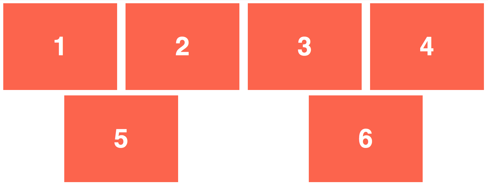
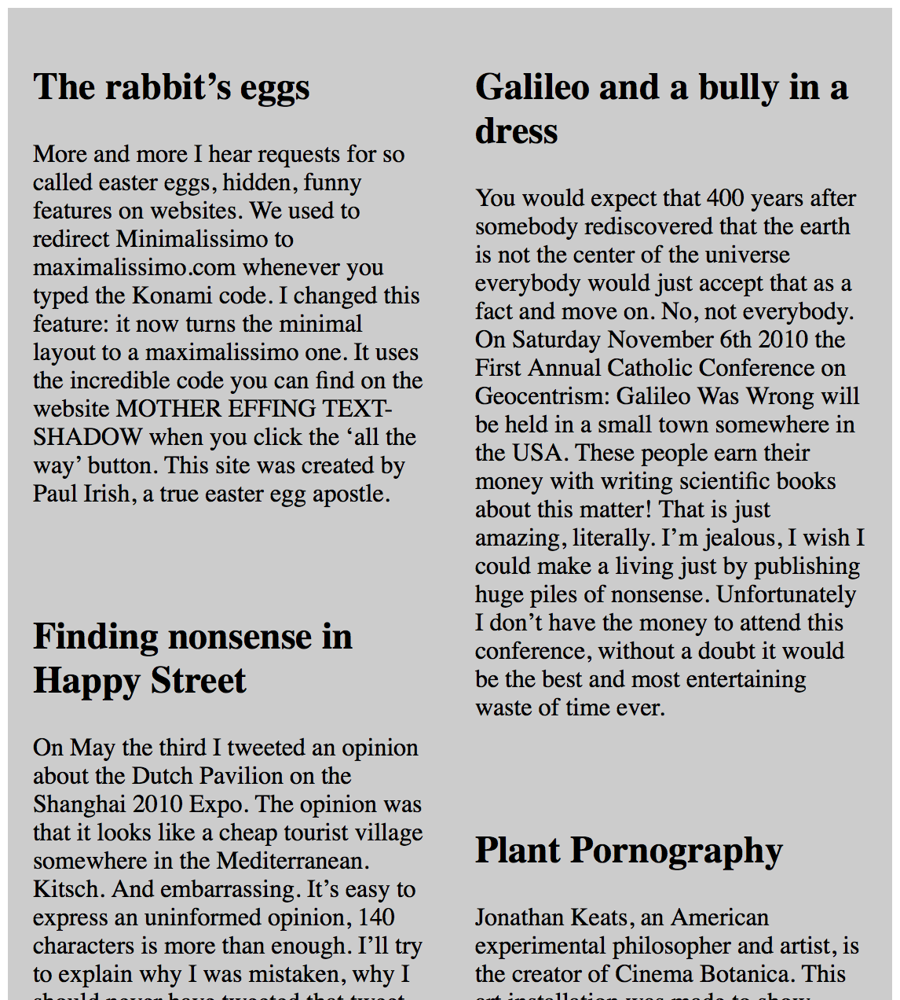
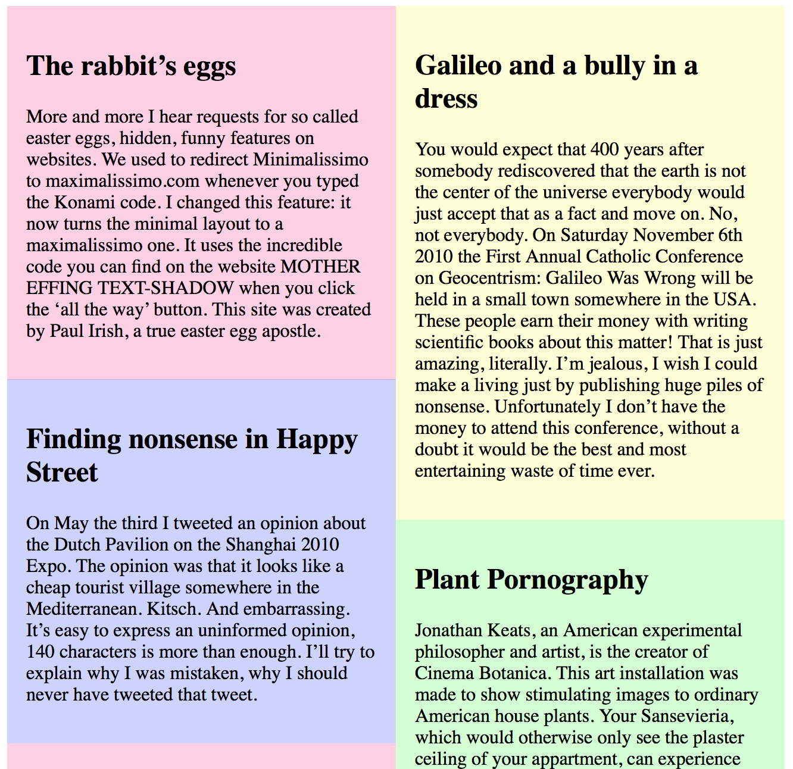
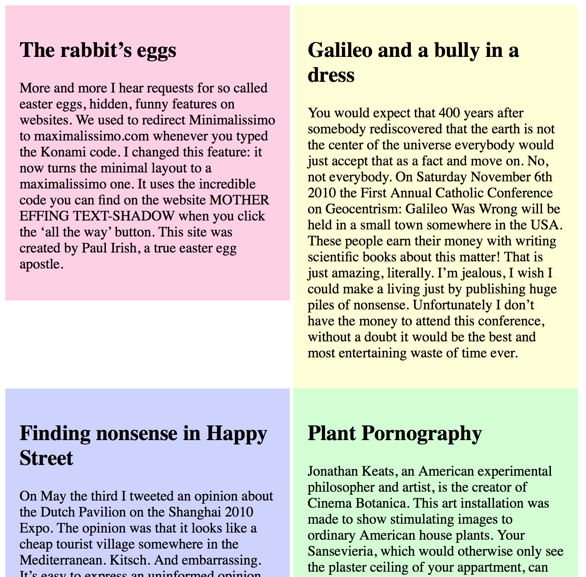
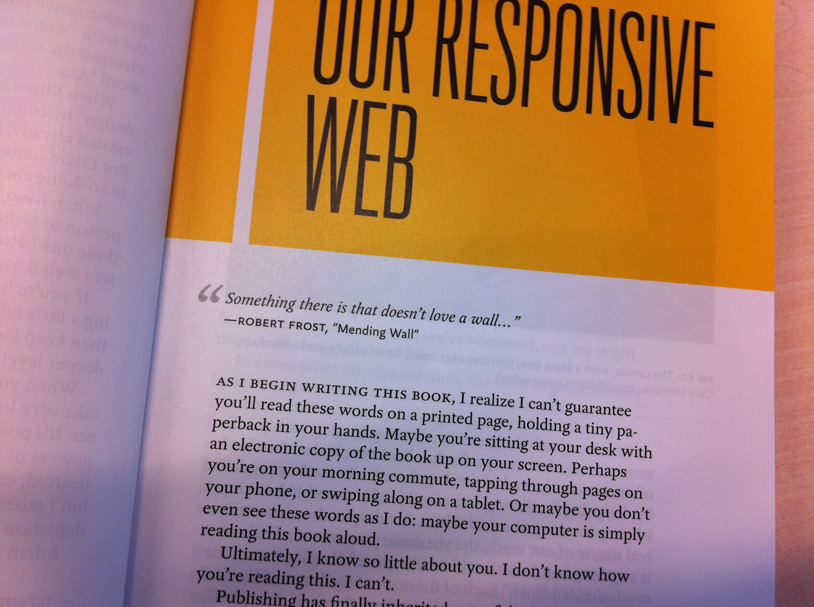
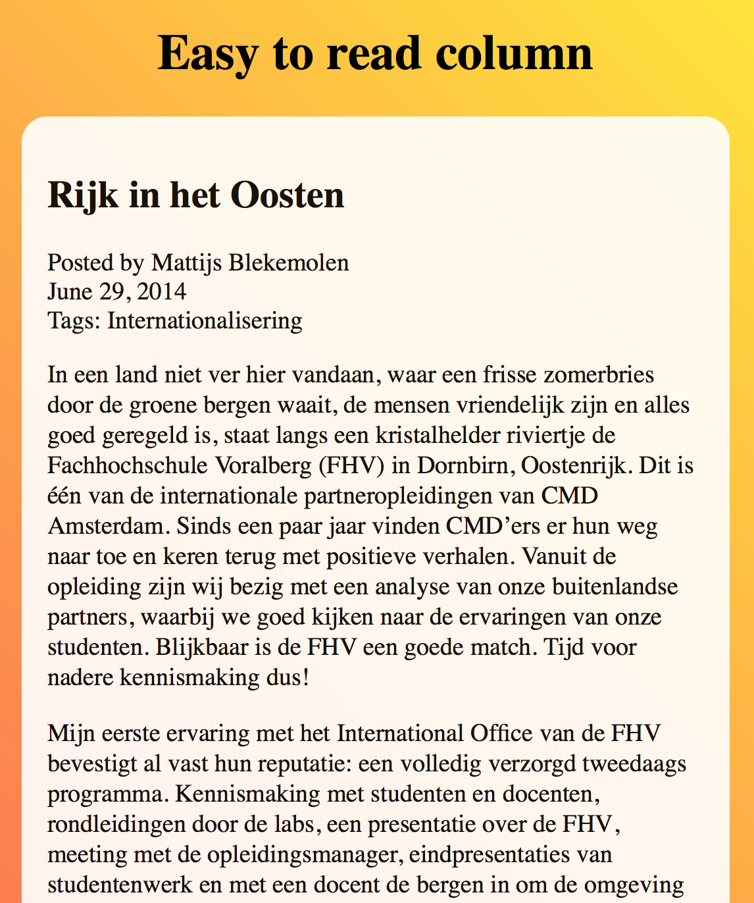
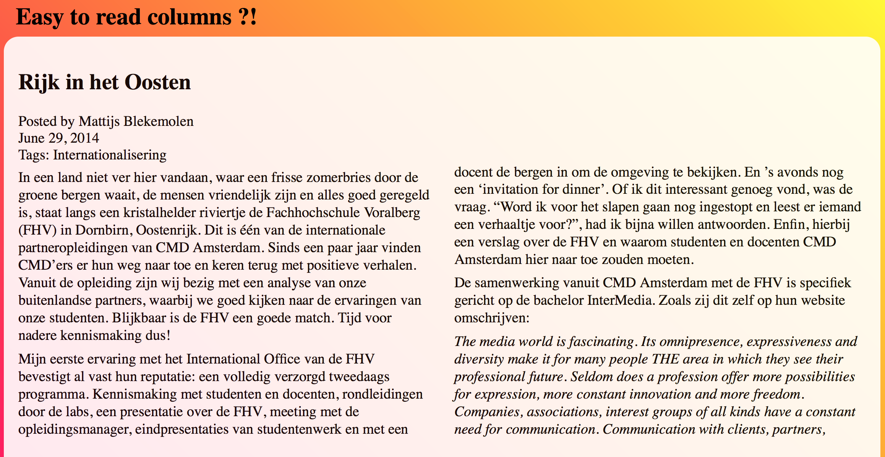

< section >
# Display: none
###### Frontend development - les 4
 
!

# Display: none
###### Frontend development - les 4
Deze les gaan we verder met de Flexbox. 
We gaan het Box-model bespreken met positionering, 
en we gaan oefenen met units voor typografie en layout.

!

# Display: none
###### Frontend development - les 4

## Programma (200 minuten)
1. Introduktie (5)
2. College (30)
3. Weekly Nerd (30)
4. Klussen (120)
5. Terugkijken (10)

!

# 1. Introduktie - 5 minuten
###### Frontend development - les 4

## Lesdoelen
* Leren over layout met CSS, floating, positioning, display
* Units for Fonts: EM, REM, relative font-size
* Units for Layout: EM, REM, VW, VH, VMIN, VMAX, relative viewport size

!

# 1. Introduktie - 5 minuten
###### Frontend development - les 4

## Op naar deeltoets 2 
In werkgroep 5 (volgende week) in duo's (10 minuten).  
Verder met het formulier en het artikel:  

* Nieuwe header en extra content
* CSS bling: effecten, transforms en transities
* CSS selectoren
* Query selector en Classlist object
* Flexbox

!

# 1. Introduktie - 5 minuten
###### Frontend development - les 4

## Op naar deeltoets 2  
  
Een nieuwe header **voor je formulier**:  
  

* [Header](https://github.com/CMDA/FED1/blob/gh-pages/Maakopdracht/header.html) 

!

# 1. Introduktie - 5 minuten
###### Frontend development - les 4

## Op naar deeltoets 2  
  
Een nieuwe header en extra content **voor je artikel**:  

* [Artikelen](https://github.com/CMDA/FED1/blob/gh-pages/Maakopdracht/Artikelen.html) 
* [Projecten](https://github.com/CMDA/FED1/blob/gh-pages/Maakopdracht/Projecten.html)

!

# 2. College - 30 minuten
###### Frontend development - les 4

College [Display: none](../Colleges/les4-display-none/index.html)
Over het Box moddel, Positioning en Units for typografie en layout

!

# 3. Weekly Nerd - 30 minuten
###### Frontend development - les 4
Iedere les gaan we artikelen bespreken in kleine groepen. 

Je wordt beoordeeld op je kennis niveau en inbreng tijdens de sessie. 
Van de 7 sessies mag je er *niet* meer dan 1 missen of onvoldoende halen. 
Als je niet voldoet aan de criteria voor de Weekly Nerd 
dan moet dit onderdeel herkanst worden met een tentamen.

!

##### 3. Weekly Nerd (30 - 65/200 minuten)
# Artikelen voor vandaag

* [The 100% Easy-2-Read Standard by Oliver Reichenstein](http://ia.net/blog/100e2r)
* [Web Design is 95% Typograph by Oliver Reichenstein](http://ia.net/blog/the-web-is-all-about-typography-period)
* [CSS Positioning by Noah Stokes](http://alistapart.com/article/css-positioning-101)

!

##### 3. Weekly Nerd (30 - 65/200 minuten)
# Wie zit waar?

lijst met indeling laten zien

!

# 4 Klussen - 120 minuten
###### Frontend development - les 4
Laptop en internet  
Opstelling werkeilanden van 6 personen - duo's zitten naast elkaar

!

## Hoe gaat het tot nu toe?
# Hoe ging het vorige week?

- rabarber rabarber

[Panic](http://youtu.be/5cSKnCBcEDo?t=1m44s)

Com'n just look at the problem:

- Bill has 3 goldfish
- He buys 2 more
- How many dogs live in London?

!

## Hoe gaat het tot nu toe?
# Welkom in de V1 !

1. We bouwen door op de kennis die je hebt geleerd in de P
2. We gaan ervan uit dat je je goed voorbereid
3. 1 + 2 = We gaan toffe dingen maken 
     daar heb je skills, vaardigheden en kennis voor nodig

!

## Hoe gaat het tot nu toe?
### Kijk jezelf aan in de [spiegel](spiegel.html)

!

## Hoe gaat het tot nu toe?
### Kom op,  we gaan toffe dingen maken

!

# 4 Klussen - 120 minuten
###### Frontend development - les 4

Vond je het vorige week moeilijk?

Leerstrategie aanpassen: Nieuwe duo's maken:

* top of the pop > links
* ja best wel > midden
* hulp behoefende soort > rechts
    
!

<<<<<<< HEAD
## Op naar deeltoets 2 

Een nieuwe header **voor je formulier**:  
  

!

## Op naar deeltoets 2  
  
Een nieuwe header en extra content **voor je artikel**:  

!

##### 4. Klussen (120 - 185/200 minuten)
### Opdracht 3.3.6 - 10 minuten
## Flexbox: netjes flex-wrap

Laatste opdracht uit les 3 herhalen

**Hoe werkt de Flex Wrap?** Zet de 6 elementen naast elkaar, behoudt de fixed breedte/hoogte. Zorg ervoor dat ze netjes horizontaal worden uitgelijnd, ook als je het browser venster kleiner/groter maakt.

    display
    flex-direction
    flex-wrap
    justify-content

**Resources**
[A guide to Flexbox](http://css-tricks.com/snippets/css/a-guide-to-flexbox/)

!

### Bespreken Opdracht 3.3.6
## Flexbox: netjes flex-wrap

Antwoord in [Dablet](http://dabblet.com/gist/796748defc249089ce4a)

Kun je ook een paar items breder maken?
Bijvoorbeeld de Nav en H1?
    
    child {
        flex-grow: <number>; /* default 0 */
        }

!
=======
>>>>>>> FETCH_HEAD

##### 4. Klussen (120 - 185/200 minuten)
### Opdracht 4.1 - 10 minuten
## Flexbox toepassen op artikelen

Voeg deze HTML toe aan je artikel-pagina:
[Artikelen](https://github.com/CMDA/FED1/blob/gh-pages/Maakopdracht/Artikelen.html) 
en [Projecten](https://github.com/CMDA/FED1/blob/gh-pages/Maakopdracht/Projecten.html).

Nu gaan we de auteur-informatie, die in het footer-element staat, 
onderaan het artikel zetten met behulp van de Flexbox.

    <article>
        <header></header>
        <footer></footer> <<< TOON FOOTER ONDERAAN ARTICLE
        <section>
            

        </section>
    </article>
!

### Bespreken Opdracht 4.1
## Flexbox toepassen op artikelen

Voorbeeld in [Dablet](http://dabblet.com/gist/64c00123c655a866ce24)

	display: flex;
	flex-direction: column;
	/*justify-content: space-between;
	align-items: flex-start;*/

    order: 1

!

##### 4. Klussen (120 - 185/200 minuten)
### Opdracht 4.2.1 - 10 minuten
## Positioning: Floating

Positioneer de artikelen en/of projecten (onder de header) naast elkaar. 
**Gebruik float ...**

**Resources**
[box-sizing](http://css-tricks.com/box-sizing/) 
[all about floats](http://css-tricks.com/all-about-floats/)

!

### Bespreken Opdracht 4.2.1
## Positioning: Floating

Voorbeeld in [Dablet](http://dabblet.com/gist/0992755f1152de27b4e9)

    float: left;
    clear: left;
    
of

    float: left;
    float: right;
    clear: both;

!

##### 4. Klussen (120 - 185/200 minuten)
### Opdracht 4.2.2 - 10 minuten
## Positioning: Position

Positioneer de artikelen en/of projecten (onder de header) naast elkaar. 
**Gebruik position ...**

**Resources**
[positioning](http://css-tricks.com/almanac/properties/p/position/)
[absolute positioning inside relative positioning](http://css-tricks.com/absolute-positioning-inside-relative-positioning/)

!

### Bespreken Opdracht 4.2.2
## Positioning: Position

Voorbeeld in [Dablet](http://dabblet.com/gist/b7ad46cb2843bb5b5e83)

    position: relative;
    top: ... ;
    left: ... ;

!

##### 4. Klussen (120 - 185/200 minuten)
### Opdracht 4.2.3 - 10 minuten
## Positioning: Display: Inline block

Positioneer de artikelen en/of projecten (onder de header) naast elkaar. 
**Gebruik inline-block ...**

**Resources**
[display](http://css-tricks.com/almanac/properties/d/display/)
[inline block](http://css-tricks.com/snippets/css/cross-browser-inline-block/)

!

### Bespreken Opdracht 4.2.3
## Positioning: Display: Inline block

Voorbeeld in [Dablet](http://dabblet.com/gist/6321f539abb0664e2ae0)

    display: inline-block;
    vertical-align: top;

!

##### 4. Klussen (120 - 185/200 minuten)
### Opdracht 4.3 - 50 minuten
## Units: The Flexible Web

I know so little about you - Ethan Marcotte, Responsive Web Design

*(t)he control which designers know in the print medium, 
and often desire in the web medium, 
is simply a function of the limitation of the printed page. 
We should embrace the fact that the web doesn’t have the same constraints, 
and design for this flexibility. 
But first, we must “accept the ebb and flow of thing.” 
- John Allsop, A Dao of Web Design*

!

**Reminder**

- Units for Fonts
    - px, EM, %, pt, Keyword
- Units for Layout
    - EM voor max/min breedtes
        - Anything from 45 to 75 characters is widely regarded as a satisfactory length of line
        - a column is easy to read if it's wide enough to accommodate an average of 10 words per line
    - REM voor margins & paddings
        - Altijd gerelateerd aan de grootte van de font-size van het html-element
        - Perfect voor margins en paddings, die gelijk kunnen blijven, ongeacht de font-grootte 
    - Viewport relative units
        - VW - viewport width
        - VH - viewport height
        - VMAX - de grootste van de width of de height
        - VMIN - de kleinste van de width of de height

!

##### 4. Klussen (120 - 185/200 minuten)
### Opdracht 4.3.1 - 20 minuten
## Units: Flexible typesetting
### I know so little about you

Je weet niet hoe groot je gebruiker de tekst wil lezen. 
Wel wil je de verhoudingen bepalen. 

Maak dit na, en gebruik EM waardes:

    <h1>I know so little about you.<a href=”#”>Read More &gt;</a></h1>

    background-color: #eee
    h1: 24 px, #333
    a: 10 px, uppercase, #666

**Resources**
[Font size px - em - % - pt](http://css-tricks.com/css-font-size/)

!

### Bespreken Opdracht 4.3.1
## Units for Typografie: Flexible typesetting
### I know so little about you

Voorbeeld in [Dablet](http://dabblet.com/gist/f9bc9f740e89db92f28c)

    Verhouding is target / context = result 
    Standaard web font, 100% = 16px
    h1 : 24/16=1.5

    24px is 1,5 groter dan 16px

    a : 10/16 = 0.626 ? Nee 

    verhouding ten opzicht van de context: a zit in de H1 
    a: 10/24 = 0.416666667 

!

##### 4. Klussen (120 - 185/200 minuten)
### Opdracht 4.3.2 - 10 minuten
## Units voor layout: Easy to Read

Zet de tekst voor het artikel op een goed leesbare grootte 
en bepaal de lengte van de zinnen. 
Gebruik de EM waarde. 
Staat de regelafstand goed? 

Je weet niet hoe groot je gebruiker de tekst wil lezen. 
Wel wil je de verhoudingen bepalen. 
Kan het ietsje minder? Window Licking?

**Resources**
[Viewport sized Typography](http://css-tricks.com/viewport-sized-typography/)
[Em or REM](http://nerd.vasilis.nl/use-em-rem-right-use-cases/)
[Theres more to the css REM unit than font sizing](http://css-tricks.com/theres-more-to-the-css-rem-unit-than-font-sizing/)

!

### Bespreken Opdracht 4.3.2
## Units voor layout: Easy to Read

Voorbeeld in [Dablet](http://dabblet.com/gist/fad9c1a6c78c3842259c)

    font-size: 1.2em;
    line-height: 1.2em;
	max-width: 26em;

!

##### 4. Klussen (120 - 185/200 minuten)
### Opdracht 4.3.3 - 10 minuten
## Units voor layout

Zet de tekst van het artikel in meerdere kolommen, 
en bepaal de verhoudingen in em of rem. 
Hoe breed moeten de kolommen zijn voor een goede regellengte?
Hoeveel ruimte moet er tussen de kolommen?

**Resources**
[CSS Columns](http://css-tricks.com/guide-responsive-friendly-css-columns/)

!

### Bespreken Opdracht 4.3.3
## Units voor layout

Voorbeeld in [Dablet](http://dabblet.com/gist/127115c338ee05559b4f)

	line-height: 1.2em;
    
	column-width: 24rem;
	column-gap: 2em;
	
    height: 52vh;
	width: 100%; 

!

# 5. Terugkijken 20 minuten
###### Frontend development - les 4

Wat hebben we behandeld (lesdoelen)?

* Leren over layout met CSS, floating, positioning, display
* Units for Fonts/em,rem, relative font-size
* Units for Layout/em,rem,vw,vh,vmin,vmax relative viewport size

!

##### 5. Terugkijken (20 - 200/200 minuten)
# Huiswerk aankondigen

* **Weekly Nerd** voorbereiden:  
  Lezen wat op Moodle staat bij les 5.
  
* **Klussen** Hoe ver moet je zijn?
Deeltoets 2 is een mondeling over 
CSS bling, CSS selectors, de Flexbox en Javascript Classlist object en query selector. 
Aan de artikel- en formulierpagina moet extra html worden toegevoegd: 
Beide pagina's moeten de extra header met HTML hebben, uit les 3.
Aan de artikelpagina moet HTML voor een aantal artikelen en projecten worden toegevoegd.

**Criteria Deeltoets 2**

De artikel- en formulierpagina bevatten alle onderwerpen zoals die in de lessen zijn behandeld: CSS bling, zoals border-radius, box-shadow, text-shadow, transforms en transitions.  
De student moet selectors, sibling combinators, pseudo classes en attribute selectors gebruiken om de pagina's te stylen, de student moet laten zien hoe het Javscript Classlist object en de query selectors werken, en (een deel van) de layout moet opgemaakt zijn met Flexbox. 
De student toont begrip en inzicht in het gebruik van verschillende CSS mogelijkheden en Javascript.

Volgende week wordt deeltoets 2 afgenomen,
in duo's
10 minuten per duo

52/2 = 26 duo's/2 (docenten) = 13 mondelingen * 10 minuten = 130 minuten

!

## op.

< / section >
