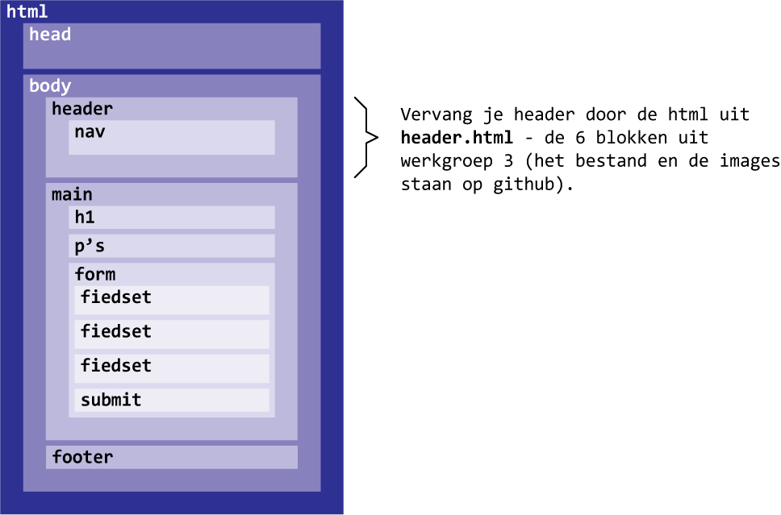
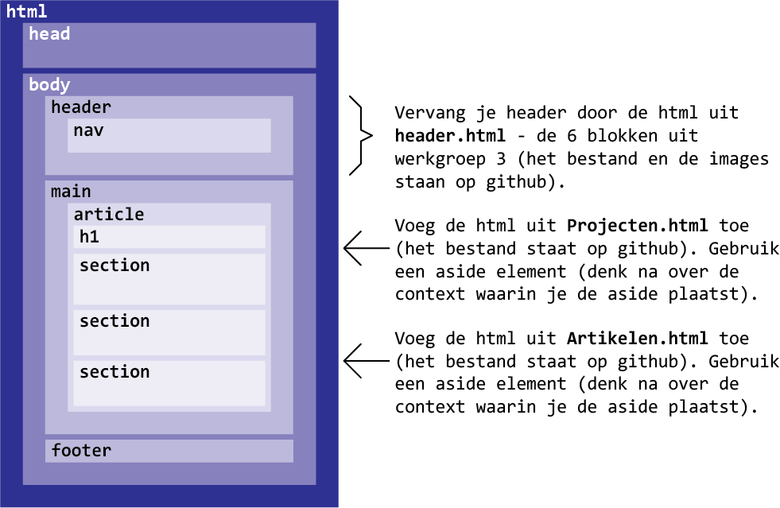
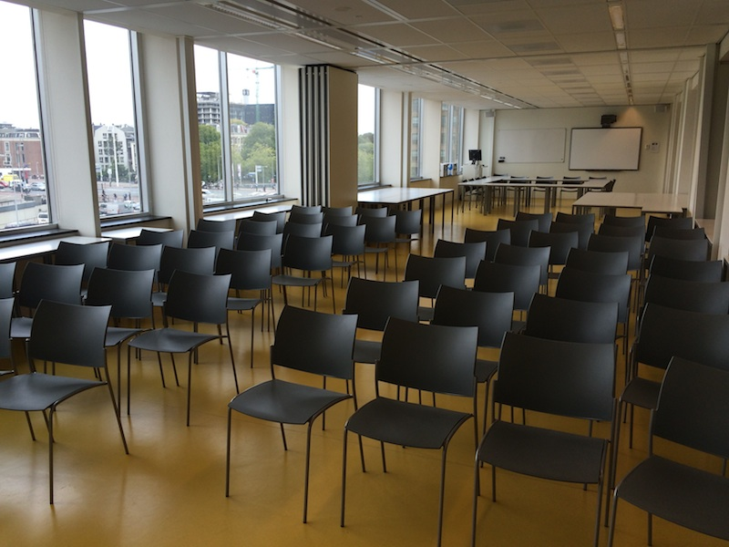
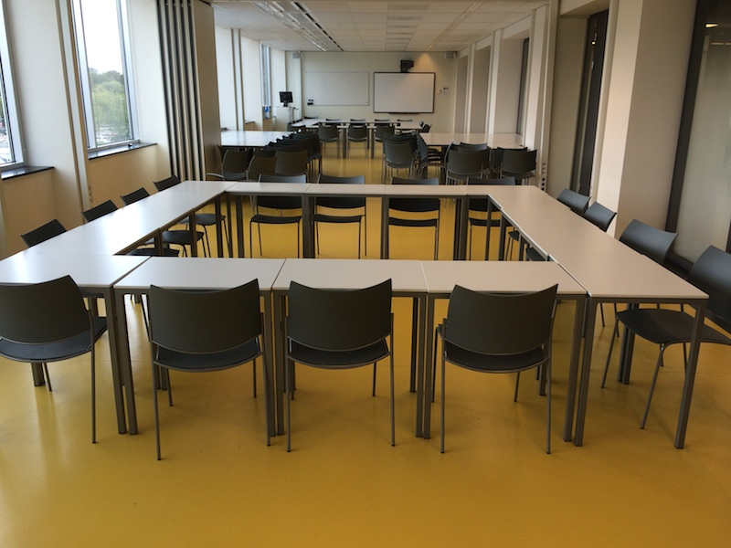
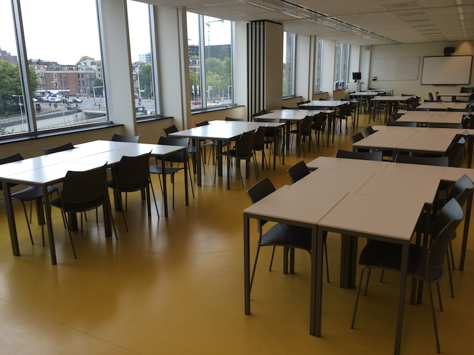

< section >
# Display: none
###### Frontend development - les 4

!

# Display: none
###### Frontend development - les 4
Deze les gaan we verder met de Flexbox. 
We gaan het Box-model bespreken met positionering, en we gaan oefenen met units voor typografie en layout.

!

# Display: none
###### Frontend development - les 4

## Programma (200 minuten)
1. Introduktie (5)
2. College (30)
3. Weekly Nerd (30)
4. Klussen (120)
5. Terugkijken (10)

!

# 1. Introduktie - 5 minuten
###### Frontend development - les 4

## Lesdoelen
- 
- 
- 

!

## Hoe gaat het tot nu toe?

# Hoe ging het vorige week?

- rabarber rabarber

!

## Hoe gaat het tot nu toe?

# Welkom in de V1 !

1. We bouwen door op de kennis die je hebt geleerd in de P
2. We gaan ervan uit dat je je goed voorbereid
3. 1 + 2 = We gaan toffe dingen maken, 
daar heb je skills, vaardigheden en kennis voor nodig

!

## Hoe gaat het tot nu toe?

**Kijk jezelf aan in de [spiegel](spiegel.html)**

- had je vorige week moeite met het CSS file in je html plaatst? 
- Had je moeite met hoe je een extern Javascript aan je HTMl kan koppelen? 
- Waarom een Javascript bepaalde dom elementen niet kon selecteren?
- Dit heb je gehad in de P, bij programmeren
    1. We bouwen door op de kennis die je hebt geleerd in de P

- Had je moeite met de attribute selector en het sterretje in het formulier? 
- En de opdracht met de pdf download link?
- Heb je alle (!) oefeningen uit les 2 thuis gemaakt? Heb je sowieso thuis doorgeklust aan je 2 pagina's?
    De eerste opdracht in les 3 (3 bij required elementen in een form) was gelijk aan de laatste opdracht in les 2. De tweede opdracht in les 3 (pdf download link) was bijna hetzelfde als de eerste opdracht.
    2. We gaan ervan uit dat je je goed voorbereid    
    
- Had je moeite met het javascript classlist object en query selector in les 3?
- Heb je het artikel over het classlist object écht bestudeert? 
- Heb je de voorbeelden uitgeprobeerd? 
- Heb je het artikel nog een keer gelezen?
- Alles wat je de vorige les hebt gedaan zit daar in ...
    2. We gaan ervan uit dat je je goed voorbereid

- let's go!
    3. We gaan toffe dingen maken

!

## Op naar deeltoets 2  
  
Een nieuwe header **voor je formulier**:  
  

!

## Op naar deeltoets 2  
  
Een nieuwe header en extra content **voor je artikel**:  

!

# 2. College - 30 minuten
###### Frontend development - les 4

College [titel](http://cmda.github.io/FED1/Colleges/???.html)
Over ...

!

# 3. Weekly Nerd - 30 minuten
###### Frontend development - les 4
Iedere les gaan we artikelen bespreken in kleine groepen. 

Je wordt beoordeeld op je kennis niveau en inbreng tijdens de sessie. Van de 7 sessies mag je er *niet* meer dan 1 missen of onvoldoende halen. Als je niet voldoen aan de gestelde criteria voor de Weekly Nerd dan moet dit onderdeel herkanst worden met een tentamen.

!

##### 3. Weekly Nerd (30 - 65/200 minuten)
# Artikelen voor vandaag

* [The 100% Easy-2-Read Standard by Oliver Reichenstein](link)
* [Web Design is 95% Typograph by Oliver Reichenstein](link)
* [CSS Positioning by Noah Stokes](link)

!

##### 3. Weekly Nerd (30 - 65/200 minuten)
# Wie zit waar?

lijst met indeling laten zien

!

# 4 Klussen - 120 minuten
###### Frontend development - les 4
Laptop en internet  
Opstelling werkeilanden van 6 personen - duo's zitten naast elkaar

Vond je het vorige week moeilijk ?!?

Leerstrategie aanpassen:

Nieuwe duos maken
	 top of the pop > links
	 ja best wel > midden
	 hulp behoefende soort > rechts 
    

!

##### 4. Klussen (120 - 185/200 minuten)
### Opdracht 3.3.6 - 10 minuten
## Flexbox: netjes flex-wrap

Flex wrap 
+ 

!

### Bespreken Opdracht 3.3.6
## Flexbox: netjes flex-wrap

!

### Opdracht 4.1

Artikelen en projecten toevoegen aan de artikel pagina
de footer van de artikelen naar beneden plaatsen met Flexbox

!

##### 4. Klussen (120 - 185/200 minuten)
### Opdracht 4 - 20 minuten
## Opdrachten

4.1 Box model
4.2 Positioneren elementen in een container
4.3 Display
4.4 Units: I know so little about you (typografie en de em)
4.5 Units: layout opzetten in verhoudigen

!

##### 4. Klussen (120 - 185/200 minuten)
### Opdracht 4.1 - 20 minuten
## Flexible typesetting: Units voor typografie

### I know so little about you

Intro

en uiteenzetten wat we wanneer gaan leren
flex box ...
responsive les ...

!

##### 4. Klussen (120 - 185/200 minuten)
### Opdracht 4.1 - 20 minuten
## Flexible typesetting

### I know so little about you

Klussen

Maak de title + read more na

!

### Bespreken Opdracht 4.1
## Flexible typesetting

!

##### 4. Klussen (120 - 185/200 minuten)
### Opdracht 4.2 - 20 minuten
## Units voor layout

* Margin en padding in rem
* Layout in procenten
* of alles in viewport relative units

# 5. Terugkijken 20 minuten
###### Frontend development - les 4

Wat hebben we behandeld (lesdoelen)?

*
*
* 

!

##### 5. Terugkijken (10 - 195/200 minuten)
# Feedback verzamelen

 
## stickies
Schrijf je feedback op een sticky en plak op het bord.

<strong style="background-color:yellow">Feedback op werkwijze</strong>
Lesprogramma, lesstructuur, discussiesessie, werkdruk?  

<strong style="background-color:PaleGreen">Feedback op deeltoets 1</strong> 
Mondeling duidelijk? Over de feedback?   

<strong style="background-color:pink">Anders?</strong>
Honger? Dorst? none-of-the-above? 

!

##### 5. Terugkijken (20 - 200/200 minuten)
# Huiswerk aankondigen

* **Weekly Nerd** voorbereiden:  
  Lezen wat op Moodle staat bij les 5.
  
* **Klussen** Hoe ver moet je zijn?
    1. Artikel pagina
    2. Formulier pagina

!

## op.

< / section >
