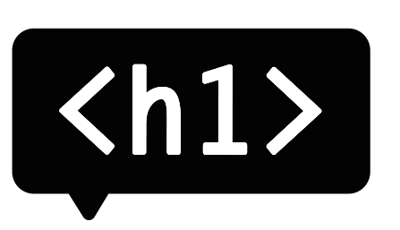
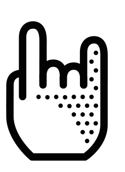

< section >
# /* no comment */
###### Frontend development - les 7

!

# /* no comment */
###### Frontend development - les 7
Deze les gaat over het picture en het video element. 
In de les gaan we doorwerken aan de eindopdracht en bespreken we de eindopdracht.

!

# /* no comment */
###### Frontend development - les 7

## Programma (200 minuten)
1. Introduktie (10)
2. College (30)
3. Weekly Nerd (30)
4. Klussen (100)
5. Terugkijken = Tentamen & Eindopdracht bespreken (20)

!

# 1. Introduktie - 5 minuten
###### Frontend development - les 7

## Lesdoelen
* Responsive images/Img srcset en Video-element kunnen toepassen 
* Klussen aan de eindopdracht
* Eindopdracht bespreken
* Weekly Nerd herkansing: Tentamen vraag

!

# 1. Introduktie - 10 minuten
###### Frontend development - les 7
## Feedback evalueren

Klik naar feedback overzicht

<strong style="background-color:yellow">Feedback op werkwijze</strong>
Lesprogramma, lesstructuur, discussiesessie, werkdruk?  

<strong style="background-color:PaleGreen">Feedback op deeltoets 1 & 2</strong> 
Mondeling duidelijk? Over de feedback?   

<strong style="background-color:pink">Anders?</strong>
Honger? Dorst? none-of-the-above?

!

# 2. College - 30 minuten
###### Frontend development - les 7

College [no comment](http://cmda.github.io/FED1/Colleges/les7-no-comment/index.html#/)

!

# 3. Weekly Nerd - 30 minuten
###### Frontend development - les 7
Iedere les gaan we artikelen bespreken in kleine groepen. 

Je wordt beoordeeld op je kennis niveau en inbreng tijdens de sessie. 
Van de 7 sessies mag je er *niet* meer dan 1 missen of onvoldoende halen. 
Als je niet voldoet aan de criteria voor de Weekly Nerd 
dan moet dit onderdeel herkanst worden met een tentamen.

!

##### 3. Weekly Nerd (30 - 70/200 minuten)
# Artikelen voor vandaag

* [A new element will make the web faster by Scott Gilbertson](http://arstechnica.com/information-technology/2014/09/how-a-new-html-element-will-make-the-web-faster/)
* [A Dao of Web Design by John Allsopp ](http://alistapart.com/article/dao)

!

##### 3. Weekly Nerd (30 - 70/200 minuten)
# Wie zit waar?

lijst op Drive laten zien

!

# 4 Klussen - 100 minuten
###### Frontend development - les 7
Laptop en internet  
Opstelling werkeilanden van 6 personen - duo's zitten naast elkaar

!

##### 4. Klussen (100 - 180/200 minuten)
### Opdracht 6.4 - 10 minuten
## Feature detection
Met Feature detection kun je bepalen wat een browser wel en niet kan. 
Vervolgens kun je een specifieke style uitvoeren.

**Opdracht 6.4.1**

1. Voeg het modernizr script toe. [http://modernizr.com](http://modernizr.com)
2. Zorg er voor dat de marges op Smartphone en Tablet worden aangepast (immers, op touch apparaten heb je eigenlijk al marges)
3. Marges op een desktop wil je wel om de website (teksten) te laten ademen

!

### Bespreken Opdracht 6.4
## Feature detection 

* Modernizr script checkt of er features beschikbaar zijn.
* It adds classes to the html element that explain precisely what features are and are not natively supported

        
        <html class=’no-js’>
        <html class=’js no-touch geolocation> 

[Features detected by Modernizr](http://modernizr.com/docs/#s2)
* Dan kun je een style aanpassen die de marges op een touch device aanpast.

        .touch {
            margin: 0 1em;
        }

!

##### 4. Klussen (100 - 180/200 minuten)
### Opdracht 7.1 - 60 minuten
## Responsive images

Gebruik srcset om verschillende .jpg files te tonen op verschillende schermgroottes

Gebruik voor deze oefening

* [picture fed 480 pixels](https://github.com/CMDA/FED1/blob/gh-pages/Maakopdracht/plaatjes/picture_fed_480.png)
* [picture fed 800 pixels](https://github.com/CMDA/FED1/blob/gh-pages/Maakopdracht/plaatjes/picture_fed_800.png)
* [picture fed 1280 pixels](https://github.com/CMDA/FED1/blob/gh-pages/Maakopdracht/plaatjes/picture_fed_1280.png)
* [picture fed 1600 pixels](https://github.com/CMDA/FED1/blob/gh-pages/Maakopdracht/plaatjes/picture_fed_1600.png)

**Resources**
[Caniuse Picture-element?](http://caniuse.com/#search=picture) 
[Responsive Images Done Right: A Guide To < picture > And srcset](http://www.smashingmagazine.com/2014/05/14/responsive-images-done-right-guide-picture-srcset/)
[Responsive Images: Use Cases and Documented Code Snippets to Get You Started](https://dev.opera.com/articles/responsive-images/)

!

### Bespreken Opdracht 7.1
## Responsive images

 
**Tekst en uitleg**

    srcset
    sizes
    Wat moet je doen als je Retina hebt?

Antwoord in [Dablet](http://dabblet.com/gist/e173b03e74e908cf3c29)

!

##### 4. Klussen (100 - 180/200 minuten)
### Opdracht 7.2 - 30 minuten
## HTML5 Video 

Plaats onderstaande bronbestanden in een < video > element.
Hij moet voor iedereen met een hedendaagse browser werken.
Zorg voor een fallback voor oude browsers. 

Video bronbestanden staan op [Github](https://github.com/CMDA/FED1/tree/gh-pages/Maakopdracht/videos)

**Resources**
[The Video Element](https://developer.mozilla.org/en-US/docs/Web/HTML/Element/video)
[Html5 supported media formats](https://developer.mozilla.org/en-US/docs/Web/HTML/Supported_media_formats)

!

### Bespreken Opdracht 7.2
## HTML5 Video 

 
**Tekst en uitleg**

Antwoord in [Dablet](https://gist.github.com/jorrit5477/2339628) 

Je geeft het video element verschillende source files voor verschillende browser ondersteuning. 
De volgorde is bepalend voor welk file wordt afgespeeld. 
Een browser ‘pakt’ een source als deze wordt herkend. 
Dus bovenaan zet je het ‘belangrijkste’ video file.

De volgorde wordt mp4 als eerste ... 
Mp4 is het kleinste bestand met de hoogste kwaliteit. 
Dat wil je eigenlijk: Meest voor het minst. 
Voor een dubbeltje op de eerste rang zitten.
Dus je bepaalt  de volgorde op basis van de kwaliteit van de video. 
Het file dat bovenaan staat probeert een browser als eerst af te spelen. 
Als dat lukt wordt de rest van de code overgeslagen. 
De ogg versie staat alleen als fallback voor een beperkt aantal oude browsers die dit alleen kunnen lezen. 
Als je deze bovenaan zet wordt deze ook door browsers gepakt die ook mp4 of webm zouden kunnen afspelen. 
En dat wil je niet. ogg is groot en minder van kwaliteit.

track / type / width / height / fallback / controls

!

### Bespreken Opdracht 7.2
## HTML5 Video 

 
**Checklist**

**Just get it working**

* HTML5, Flash, Mobile: MP4/H.264, Baseline profile, 640×480
* HTML5: WebM

**Round it out a little**

* HTML5, Flash: MP4/H.264, High profile
* HTML5: WebM
* Mobile: MP4/H.264, Baseline profile, 480×360 or 640×480

**Support everything well**

* HTML5, Flash: MP4/H.264, High profile
* HTML5: WebM
* HTML5: Ogg
* Mobile: MP4/H.264, Baseline profile, 480×360, for older mobile devices
* Mobile: MP4/H.264, Main profile, 1280×720, for older iOS devices (iPhone 4 and older iPads/Apple TV). The newest devices (iPhone 5, etc) can support the desktop High profile rendition.
* Mobile: 3GP/MPEG4, 320×240 and/or 177×144, for non-smartphones*

[http://blog.zencoder.com/2013/09/13/what-formats-do-i-need-for-html5-video/](http://blog.zencoder.com/2013/09/13/what-formats-do-i-need-for-html5-video/)

!

# 5. Terugkijken 20 minuten
###### Frontend development - les 7

Wat hebben we behandeld (lesdoelen)?

* Responsive images/Img srcset en Video-element kunnen toepassen 
* Klussen aan de eindopdracht
* Eindopdracht bespreken
* Weekly Nerd herkansing: Tentamen vraag

!

# 5. Terugkijken 20 minuten
###### Frontend development - les 7

 

###Agenda terugkijken
Terugkijken = Tentamen & Eindopdracht bespreken

**1. Moet je een tentamen maken?**

Datum: Vrijdag 7 november, 12:50, TTH

Oefenvraag slide 22

**2. Criteria, beschrijving, werkwijze en inspiratie voor de eindopdracht?**

Schrijf je in voor het mondeling op [Moodle](https://moodle.dmci.hva.nl/moodle21/course/view.php?id=131)

Beschrijving en criteria slide 23-32

!

##### 5. Terugkijken (20 - 190/200 minuten)
#Tentamen
Tentamen over de artikelen die zijn besproken tijdens de Weekly Nerd. 

* Het tentamen bestaat uit 5 open vragen (a, b, soms c)
* Duur van de toets is maximaal 100 minuten
* Geschreven aantekeningen mag je erbij houden 
* Geen laptop open. Geen mobile en/of tablet 

Het tentamen gaat over de artikelen: 1.1, 1.2, 1.3, 2.2, 2.3, 3.1, 4.1, 4.2, 5.1, 5.2, 6.1, 6.2, 7.1, 7.2

!

##### 5. Terugkijken (20 - 190/200 minuten)
#Tentamen 
##gaat over deze artikelen

* 1.1 [Concept to Code: Code literacy in UX by by Ryan Betts](http://uxmag.com/articles/concept-to-code)
* 1.2 [Semantics in HTML 5 by John Allsopp](http://alistapart.com/article/semanticsinhtml5)
* 1.3 [Importance of sections by Haydon Pickering](http://www.smashingmagazine.com/2013/01/18/the-importance-of-sections/)
* 2.2 [How to use pseudo classes by Richard Shepherd](http://www.smashingmagazine.com/2011/03/30/how-to-use-css3-pseudo-classes/)
* 2.3 [The Design of HTML5 by Jeremy Keith](https://vimeo.com/15755349)
* 3.1 [Using pixels is not very polite by Vasilis van Gemert](http://nerd.vasilis.nl/using-pixels-polite/)
* 4.1 [The 100% Easy-2-Read Standard by Oliver Reichenstein](http://ia.net/blog/100e2r)
* 4.2 [Web Design is 95% Typograph by Oliver Reichenstein](http://ia.net/blog/the-web-is-all-about-typography-period)
* 5.1 [Responsive Design tips & tricks by Andreas Bovens](https://vimeo.com/48433478)
* 5.2 [Fixed vs Fluid vs Elastic layout by Kayla Knight](http://www.smashingmagazine.com/2009/06/02/fixed-vs-fluid-vs-elastic-layout-whats-the-right-one-for-you/)
* 6.1 [Responsive navigation patterns by Brad Frost](http://bradfrostweb.com/blog/web/responsive-nav-patterns/)
* 6.2 [11 reasons Responsive Design noy cool by Juan Sarmiento](http://www.webdesignshock.com/responsive-design-problems/)
* 7.1 [A new element will make the web faster by Scott Gilbertson](http://arstechnica.com/information-technology/2014/09/how-a-new-html-element-will-make-the-web-faster/)
* 7.2 [A Dao of Web Design by John Allsopp ](http://alistapart.com/article/dao)

!

##### 5. Terugkijken (20 - 190/200 minuten)
#Tentamen 
##Oefenvraag

 
*Betreft artikel: 
The 100% Easy-2-Read Standard 
& 
Web Design is 95% Typograph 
by Oliver Reichenstein*

Beschrijf wat volgens het artikel de taak is van een webdesigner. 
Ben je het hiermee eens? Verwoord je mening over de stelling van Oliver Reichstein.

-- taak van de webdesigner (1 punt)

-- Ben je het hiermee eens? (2 punten) 

!

##### 5. Terugkijken (20 - 190/200 minuten)
# Frontend development
## Waar begonnen we 8 weken geleden?

 

###Beschrijving van het vak Frontend development
In het vak Frontend development leren studenten een responsive website maken, 
een website die zich automatisch aanpast aan de context, het apparaat, de omgeving en de interactie mogelijkheden. 

###Beschrijving eindopdracht 
Eindopdracht is een responsive website maken van het intranet: 
een artikelpagina en een formulierpagina

!

##### 5. Terugkijken (20 - 190/200 minuten)
# Frontend development
## Intentie van het vak (intranet)
Het tweedejaars vak Frontend development is een techniek vak voor design studenten. 
In de propedeuse ligt de nadruk op het maken van een eenvoudige websites. 
Dit vak gaat een stap verder. 

Wat moeten de studenten aan het eind van de cursus kunnen? 
Aan het eind van de cursus zijn studenten in staat een responsive website te maken, 
dat is een website die zich automatisch aanpast aan de context waarin de website wordt bekeken. 
De context wordt bepaald door de verschillende eigenschappen van de verschillende apparaten, 
zoals desktop, mobile en tablet, de interactie mogelijkheden 
en de omgeving waarin de website wordt bekeken. De website kunnen ze maken met behulp van de webtechnieken HTML5, CSS3 en Javascript en deze technieken worden volgens de juiste semantiek en gevalideerd toegepast.  Het vak geeft inzicht in de mogelijkheden en beperkingen van deze technieken. Voor het maken van de website zijn studenten in staat betrouwbare bronnen te zoeken en raadplegen en de studenten zijn in staat code van anderen te lezen en te hergebruiken.

!

##### 5. Terugkijken (20 - 190/200 minuten)
# Eindopdracht
## Wat kun je nu maken?
Stap voor stap heb je geleerd een responsive design te maken.

### Weet je nog Les 1?

Wat kun je over 8 weken?

* [www.tropenmuseum.nl](http://www.tropenmuseum.nl) Voorbeeld Responsive 2011 
* [www.rijksmuseum.nl](http://www.rijksmuseum.nl) Total web experience ? 2013
* [decorrespondent.nl](https://decorrespondent.nl/home#) 100% Leesbaar multi device
* [Komkommersalade](http://vasilis.nl/presentaties/eretail/site/shop.php) Voorbeeld Responsive webshop (P4)

!

##### 5. Terugkijken 20 minuten
# Eindopdracht
## HTML voor de Artikelpagina

De Artikelpagina bestaat uit:

1. Header < [toevoegen](https://github.com/CMDA/FED1/blob/gh-pages/Maakopdracht/header.html)
2. Main: Artikel < [toevoegen](https://github.com/CMDA/FED1/blob/gh-pages/Maakopdracht/1.0%20Opleiding%2020140908.pdf?raw=true)
3. Section: 5 nieuws-artikelen < [toevoegen](https://github.com/CMDA/FED1/blob/gh-pages/Maakopdracht/Artikelen.html)
4. Section: 3 projecten < [toevoegen](https://github.com/CMDA/FED1/blob/gh-pages/Maakopdracht/Projecten.html)
5. Sidebar < [toevoegen](https://github.com/CMDA/FED1/tree/gh-pages/Maakopdracht/Sidebar.html)
6. Footer < [toevoegen](https://github.com/CMDA/FED1/tree/gh-pages/Maakopdracht/Footer.html)

!

##### 5. Terugkijken 20 minuten
# Eindopdracht
## HTML voor de Formulierpagina

De Formulierpagina bestaat uit:

1. Header < [toevoegen](https://github.com/CMDA/FED1/blob/gh-pages/Maakopdracht/header.html)
2. Main: Formulier < [toevoegen](https://github.com/CMDA/FED1/blob/gh-pages/Maakopdracht/4.0.1%20Aanmelden%2020140908.pdf?raw=true)
3. Section: 3 projecten < [toevoegen](https://github.com/CMDA/FED1/blob/gh-pages/Maakopdracht/Projecten.html)
4. Sidebar < [toevoegen](https://github.com/CMDA/FED1/tree/gh-pages/Maakopdracht/Sidebar.html)
5. Footer < [toevoegen](https://github.com/CMDA/FED1/tree/gh-pages/Maakopdracht/Footer.html)

!

##### 5. Terugkijken 20 minuten
# Eindopdracht
## Style elementen 

[Hier](https://github.com/CMDA/FED1/tree/gh-pages/Maakopdracht/plaatjes) staan iconen, kleuren, foto's en de beeldtaal beschrijving van de huisstijl van CMD. 
Dit kun je gebruiken om je pagina's te stylen.

!

##### 5. Terugkijken 20 minuten
# Eindopdracht
## Inspiratie 

Op de website [mediaqueri.es](http://mediaqueri.es) staan veel voorbeelden van responsive layouts.

De website van het [Rijksmuseum](https://www.rijksmuseum.nl) met de collecties vinden we tof

De [omroep.nl](http://www.omroep.nl) website doet het responsive goed, met plaatjes en video die mooi mee schalen.

Hier kun je mooi zien of jouw website het een beetje mooi doet: 
[ami.responsivedesign.is](http://ami.responsivedesign.is/?url=http%3A%2F%2Fwww.cmd-amsterdam.nl)

!

##### 5. Terugkijken 20 minuten
# Eindopdracht
## Criteria 

De artikelpagina en formulierpagina moeten responsive zijn. 
Het web bestaat uit verhoudingen, niet uit absolute waardes. 
De layout past zich aan aan de scherm-breedte en scherm-hoogte. 
Je moet ontwerp beslissingen maken.
Layout is belangrijker dan styling.  
De twee pagina's moeten minimaal op je laptop en één touch apparaat worden gepresenteerd.

!

##### 5. Terugkijken 20 minuten
# Eindopdracht
## Ontwerp beslissingen maken

1. Waar gaat de Sidebar heen als het scherm breed is?
2. Hoe staan de sections met Projecten en Nieuwartikelen?
4. Wat gebeurt er als de gebruiker de pagina gaat zoomen?
5. Pas de marges en/of padding van de pagina aan (deze mogen dichter op de rand van je telefoon - probeer maar eens)
6. Hoeveel ruimte heeft de header nodig op mobiel? tablet?
7. Misschien wil je van de project-artikelen en nieuws-artikelen op mobiel wel alleen de titel laten zien? Met een toggle inklappen/uitklappen ?
8. Is de tekst goed leesbaar?
9. Zijn de regels van het < main > artikel niet te lang?
10. Hoeveel ruimte heeft de header nodig, en wat staat er in? 
11. Kunnen de project-artikelen en nieuws-artikelen in meer kolommen?
12. Hoe ziet het formulier er uit op een breder scherm?

!

##### 5. Terugkijken 20 minuten
# Eindopdracht
## Toetsing 

De website bevat alle onderwerpen zoals die in de lessen zijn behandeld:

**Minimaal:**

* De website is gemaakt met behulp van HTML5, CSS3 en Javascript
* De pagina's bevatten alle HTML zoals die is aangeleverd
* HTML5 moet correct gevalideerd zijn, danwel je moet kunnen uitleggen hoe je een error melding van een validator kan oplossen
* De CSS3 wordt extern ingeladen
* Met behulp van javascript worden dynamisch classes toegevoegd of weggehaald
* De layout en vormgeving is responsive en past zich aan aan de schermgrootte
* Er wordt correct gebruik gemaakt van verschillende Media queries

**Hoger cijfer:**

* Met Feature detection wordt de layout en/of interactie aangepast aan een specifiek apparaat
* Minimaal één van de pagina's bevat een  picture, video, audio en/of sourceset-element die functioneel zijn toegepast

!

(fed is)
## op.

< / section >

